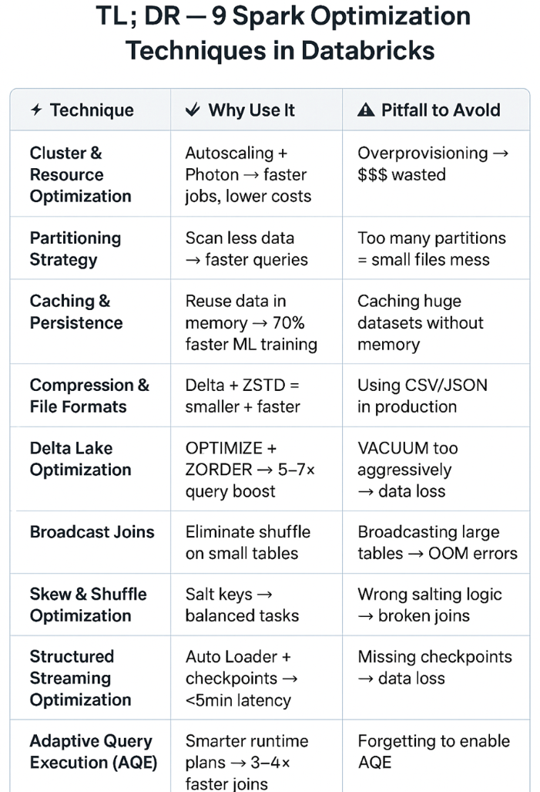

# Session 6 — Performance & Cost Optimization

**Master Class DataOps for Modern Data Platforms · Session 6/11**

Session 5 got data into a lakehouse. This session is about making it *fast*. You will
learn to read the signals — Spark UI stage metrics, physical query plans, `EXPLAIN ANALYZE`
— and use them to find real bottlenecks, not guesses. The pattern is always the same:
**Measure → Find the root cause → Fix → Re-measure and keep both numbers**.

The demos walk through the diagnosis loop live. The labs and homework hand you
**broken pipelines** with no hint — your job is to reproduce the symptom, find the
cause with evidence, fix it, and prove the fix with before/after numbers.

---

## 🏗️ Stack

| Component | Tool | Port |
|---|---|---|
| Processing | PySpark 3.5 (`apache/spark:3.5.0`) | — |
| Storage | Delta Lake 3.2 + MinIO | 9000 (API) · 9001 (Console) |
| Spark Master UI | standalone master | 8080 |
| Spark App UI | driver (only while a job runs) | 4040 |
| **Spark History Server** | replays completed jobs | **18080** |
| DWH (homework 3) | DuckDB | — (host, file-based) |

**Medallion layout on MinIO:**

| Layer | Bucket | Contents |
|---|---|---|
| Bronze | `s3a://bronze/` | raw generated Parquet (`orders`, `order_items`, `customers`, `payments`) |
| Silver | `s3a://silver/` | curated Delta tables (same names; `orders` partitioned by `order_date`) + lab ingest tables |
| Gold | `s3a://gold/` | job outputs (aggregated business tables) |

> The Delta/S3A jars are **reused from session_05** — the compose mounts
> `../session_05_pyspark_lakehouse/jars`. Download them in session_05 first.

> Port note: **8080 is the Spark Master UI**, **4040 is the live app UI** — not Airflow.
> There is no Airflow in this session.

---

## 🚀 How to Run

All commands run from `session_06_performance_optimization/`. Every `spark-submit`
ships the shared helper with `--py-files /scripts/spark_common.py`.

### 0. Prerequisites
- Docker Desktop (≥ 6 GB RAM allocated — 2 workers x 2 GB plus master/history/MinIO).
- **≥ 15 GB free disk in the Docker VM** (check with `docker system df`; the generated
  data plus Delta table history needs room to breathe — see Common errors if a job
  dies with `No space left on device`).
- The session_05 jars must already exist.
- Host Python only for homework 3: `pip install -r requirements.txt` (just `duckdb`).

### 1. Start the stack
```bash
docker compose up -d
docker compose ps           # wait until services are healthy
```
UIs: Spark Master http://localhost:8080 · History http://localhost:18080 ·
MinIO http://localhost:9001 (minioadmin/minioadmin)

### 2. Generate the data (Spark → bronze)
```bash
docker exec s06-spark-master /opt/spark/bin/spark-submit \
  --master spark://spark-master:7077 \
  --py-files /scripts/spark_common.py /scripts/generate_data.py --scale large
```
`--scale large` (default, ~15M orders / 50M items) makes the broken jobs run for
**several minutes** so the signal is real. Use `--scale small` for a quick dry run.

### 3. Load the silver Delta tables
```bash
docker exec s06-spark-master /opt/spark/bin/spark-submit \
  --master spark://spark-master:7077 \
  --py-files /scripts/spark_common.py /scripts/setup_delta_tables.py
docker exec s06-spark-master /opt/spark/bin/spark-submit \
  --master spark://spark-master:7077 \
  --py-files /scripts/spark_common.py /scripts/setup_lab2_table.py
```
The second script loads the table used by Lab 2 the same way the daily pipeline
built it in production: one ingest run per day of history.

### 4. Run the demos / labs / homework
See the folder READMEs — each has exact commands, notes, and (for labs/homework) the
completion checklist:
- [demo/README.md](demo/README.md) — 2 demos
- [labs/README.md](labs/README.md) — 3 labs
- [homework/README.md](homework/README.md) — 3 take-home exercises

### 5. Analyze in the History Server
After any job, open **http://localhost:18080**, click the app, and inspect
**Stages → Summary Metrics** and the **SQL/DataFrame** plan. Runs are persisted, so you
can re-open a run and compare before/after your fix without keeping the driver alive.

### 6. Tear down
```bash
docker compose down          # keep data
docker compose down -v       # also wipe the MinIO volume
```

---

## 📊 Dataset

`scripts/generate_data.py` (Spark) writes four Parquet datasets to `s3a://bronze/`.
Purchase timestamps span **2026-07-01 → 2026-07-21**.

**orders** — `order_id` (PK), `customer_id`, `order_status`, `order_purchase_timestamp`,
`order_approved_at`, `order_delivered_timestamp`, `order_estimated_delivery_date`,
`order_channel`, `device_type`, `coupon_code`, `customer_note`.
Silver copy partitioned by `order_date` (= date of purchase), one file per day.

**order_items** — `order_id`, `order_item_id`, `product_id`, `seller_id`, `product_category`,
`product_name`, `product_weight_g`, `product_length_cm`, `product_height_cm`,
`product_width_cm`, `price`, `shipping_charges`. Silver copy adds `order_date` (from the
order) and is partitioned by it.

**customers** — `customer_id` (PK), `customer_name`, `customer_zip_code_prefix`,
`customer_city`, `customer_state`, `customer_street`, `customer_number`,
`customer_neighborhood`, `customer_phone`, `customer_email`.

**payments** — `order_id`, `payment_sequential`, `payment_type`, `payment_installments`,
`payment_value`, `payment_provider`, `card_brand`, `authorization_code`.

Scales: `--scale small | medium | large` (default `large`: orders 15M, items 50M —
several GB in silver, so the broken jobs run for minutes, not seconds).

**Pre-class check** — confirm you are on large data before running anything:
```bash
docker exec s06-spark-master /opt/spark/bin/spark-submit \
  --py-files /scripts/spark_common.py /scripts/get_num_files.py s3a://silver/orders
```
Expect ~15M rows in ~21 files. 500K rows means the small dev dataset is still loaded —
regenerate with `--scale large` and re-run the setup script.

Helper scripts:
- `scripts/get_num_files.py <delta_path>` — file count / size / rows of a Delta table.
- `scripts/operations/compact_files.py <delta_path>` — `OPTIMIZE` a Delta table and
  report the file count before/after.
- `scripts/operations/vacuum.py <delta_path> <retain_hours>` — `VACUUM` a Delta table
  (removes files no longer referenced within the retention window).
- `scripts/operations/clean_spark_tmp.sh` — wipe worker temp dirs and trim event logs
  to the 5 most recent runs (run this if a job dies with `No space left on device`).

---

## 📋 Submission format (per lab / homework)

Submit one short markdown or notebook file with:

1. **Symptom** — screenshot or pasted numbers from Spark UI / EXPLAIN (not prose).
2. **Root cause** — what is actually wrong, and the evidence that told you.
3. **Fix** — the code/config you changed.
4. **Before / After** — a table of the numbers that changed.
5. **Mechanism** — 2-3 sentences on *why* the fix addresses the root cause.

Grading: root cause **30%** · fix **30%** · before/after numbers **20%** · mechanism **20%**.
A correct fix with no explanation does not score full marks.

---

## 🚑 Common errors & fixes

| Symptom | Cause | Fix |
|---|---|---|
| `Bind for 0.0.0.0:8080 failed: port is already allocated` | Another session's stack (e.g. Airflow) holds 8080 | `docker compose down` in that session's folder first |
| Job hangs forever at an S3A write, no progress in logs | MinIO container is not running/healthy | `docker compose ps`, then `docker compose up -d minio` and re-run |
| `ClassNotFoundException: ...DeltaSparkSessionExtension` | session_05 jars missing (empty `/opt/jars` mount) | download the jars in session_05 first (see its README) |
| `DELTA_FAILED_TO_MERGE_FIELDS` on setup | a stale Delta table from an older schema exists at the target path | re-run `setup_delta_tables.py` (it overwrites the schema); if it persists, delete the table folder in MinIO |
| `IO Error: Could not set lock on file ... hw3.duckdb` | DBeaver (or another client) holds the DuckDB file | close the other connection, or open it read-only |
| History Server shows no runs | job was run without the shared `spark-defaults.conf` (event logging off) | run jobs via `docker exec s06-spark-master spark-submit ...` as documented |
| `java.io.IOException: No space left on device` mid-job | the Docker VM disk is full (Spark shuffle/Delta writes have no room) | free space (`docker system prune`, remove unused volumes) or raise Docker Desktop → Resources → Disk image size, then re-run |
| `java.lang.OutOfMemoryError: Java heap space` on a setup script | `spark-submit` was run without `--master spark://spark-master:7077`, so the whole job ran in one local 1 GB JVM | re-run with the `--master` flag exactly as documented above |

## 🧭 Best practices (real life)

- **Measure before you tune.** Change nothing until a metric tells you where the time goes.
- **Read the plan before the code.** Most bottlenecks are visible in the physical plan
  or the stage metrics long before you find them by reading source.
- **Fix the biggest number first.** One 10-minute stage beats twenty 5-second wins.
- **Compact continuously ingested tables on a schedule** — file layout degrades by
  design, not by accident.
- **Keep filters deterministic.** Wall-clock functions in WHERE clauses break both
  reproducibility and the optimizer.
- **Prefer engine-native over hand-rolled.** Built-in functions and AQE beat custom
  code and manual tuning in most cases; tune manually only what the engine cannot see.
- **Re-measure after the fix and keep both runs.** A fix without a before/after number
  is a guess.

## More common: Spark Optimization Techniques


---

## 📁 Project structure

```
session_06_performance_optimization/
├── README.md
├── docker-compose.yml           ← MinIO (bronze/silver/gold) + Spark master/worker/history
├── requirements.txt             ← host libs (homework 3 only: duckdb)
├── conf/spark-defaults.conf     ← event logging + spark.jars (no --jars needed)
├── scripts/
│   ├── spark_common.py          ← shared build_spark() + get_logger() (via --py-files)
│   ├── generate_data.py         ← Spark data generator → bronze
│   ├── setup_delta_tables.py    ← bronze parquet → silver Delta
│   ├── setup_lab2_table.py      ← replays the daily ingest history for Lab 2's table
│   ├── get_num_files.py         ← file stats for a Delta table
│   └── operations/
│       ├── compact_files.py     ← OPTIMIZE a Delta table, report before/after
│       ├── vacuum.py            ← VACUUM a Delta table (configurable retention)
│       └── clean_spark_tmp.sh   ← wipe worker /tmp + trim event logs to 5 newest
├── demo/                        ← 2 demos (README inside)
├── labs/                        ← 3 labs (README + checklist inside)
├── homework/                    ← 3 homework (README + checklist inside)
├── data/                        ← hw3.duckdb (gitignored)
└── spark-events/                ← Spark event logs (read by History Server)
```
