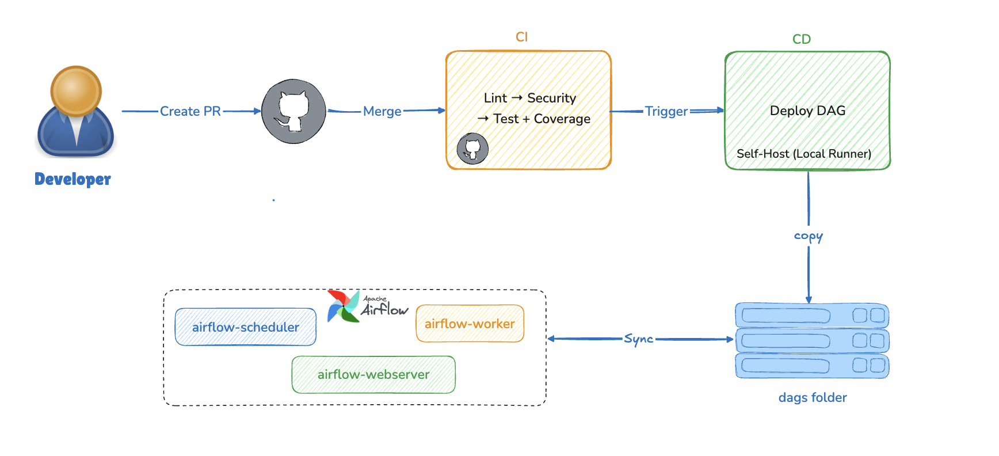

# Session 08 Demo — CI/CD for Data Pipeline

## Prerequisites

```bash
cd session_08_cicd
pip install -r requirements-dev.txt
```

## Demo 1 — Setup CI workflow

Live-code from scratch. Open a terminal side-by-side with the editor.

**Step 1 — create pyproject.toml and requirements-dev.txt**

Show each line and explain why: ruff replaces flake8+black, bandit catches secrets and SQL injection risk, pytest-cov enforces the coverage gate.

**Step 2 — create .github/workflows/ci.yml**

Write the three layers in order and pause after each one:

```
Lint → Security → Test
```

Key talking points:
- Order matters: lint fails in 5 seconds, saving the 3-minute test run for a syntax error
- `cache: 'pip'` cuts install from ~60s to ~5s after the first run
- `--cov-fail-under=70` makes the coverage report actionable — CI fails if coverage drops

**Step 3 — push and open Actions tab**

Show the three layers going green. Point out the coverage report in the `Unit test + coverage` step log — the `TOTAL` line and which lines are not covered.

---

## Demo 2 — Unit test edge cases

Run `pytest -v` in the terminal after each group. You must see the test output, not just the code.

> **Note:** PySpark requires Java 8 or 11. Check your version with `java -version`. If you have Java 17+, set `JAVA_HOME` before running Spark tests:
> ```bash
> # Java 8
> JAVA_HOME=$(/usr/libexec/java_home -v 1.8) pytest demo/tests/test_spark/ -v
> # Java 11
> JAVA_HOME=$(/usr/libexec/java_home -v 11) pytest demo/tests/test_spark/ -v
> ```

**Group 1 — DAG tests** (`demo/tests/test_dags/test_order_pipeline.py`)

```bash
pytest demo/tests/test_dags/ -v
```

Point out `test_no_catchup`: this would have silently backfilled months of history on the first deploy — CI catches it before merge.

**Group 2 — SQL tests** (`demo/tests/test_sql/test_silver_transform.py`)

```bash
pytest demo/tests/test_sql/ -v
```

Point out `test_silver_filters_null_customer` and `test_silver_rejects_negative_amount`: run the bronze SQL first so you see the NULL and negative rows in the source, then show silver blocks them.

**Group 3 — PySpark tests** (`demo/tests/test_spark/test_spark_transform.py`)

```bash
pytest demo/tests/test_spark/ -v
```

Point out `test_processed_at_is_deterministic`: run transform twice with a 1-second gap, show both `processed_at` values are identical — the job is safe to retry at 3 AM.

**Coverage report**

```bash
pytest demo/tests/ --cov=demo/dags --cov=demo/jobs --cov-report=term-missing
```

Walk through the `TOTAL` line. Point to at least one uncovered branch and ask "what test would cover this?"

---

## Demo 3 — CD deploy DAG
The simple flow for this demo/lab


Live-code `.github/workflows/cd.yml`.

> **Airflow environment:** Session 08 reuses the session_07_security Docker stack.
> If it is not already running, start it from the `session_07_security/` folder before
> this demo:
> ```bash
> cd session_07_security
> docker compose up -d
> # wait ~60 s for the healthchecks to pass
> curl -s -u airflow:airflow http://localhost:8888/health | python3 -m json.tool
> ```
> The `session_08_order_pipeline` DAG is mounted from `session_07_security/demo/dags/`
> and will appear in the Airflow UI automatically once the stack is healthy.

**One-time setup before the demo:**

Install a self-hosted runner on the laptop — the runner receives jobs from GitHub and executes commands locally, no inbound SSH required:

```bash
# GitHub repo → Settings → Actions → Runners → New self-hosted runner
# Select OS, copy the download + configure commands, then:
./run.sh   # keep this terminal open throughout the demo
```

The runner connects to GitHub over outbound HTTPS only — no ports need to be opened on the laptop.

**Key points when live-coding cd.yml:**

1. `workflow_run` trigger — CD fires only after the `DataOps CI` workflow completes; show the `workflows:` name must match exactly
2. `if: conclusion == 'success'` — without this condition, CD runs even when CI failed; show what happens when this line is missing
3. `runs-on: self-hosted` — job runs on the laptop that already has Airflow, not on GitHub's server
4. `git -C ${{ vars.REPO_PATH }} pull origin main` — set `REPO_PATH` as a GitHub Actions variable (Settings → Variables) pointing to the local repo; no secrets needed since it's just a path
5. `Verify DAG loaded` calls the Airflow API at `localhost:8080` — the workflow itself confirms the deploy succeeded

**Merge and watch:**

1. Open a PR, show CI running on `ubuntu-latest`.
2. Merge — CD triggers on the `self-hosted` runner (the `run.sh` terminal will show the job executing).
3. Open Airflow UI — DAG appears within 60 seconds.

---

## Common errors

| Error | Cause | Fix |
|---|---|---|
| `bandit` reports B105 on test fixtures | test files scanned | `exclude_dirs = ["demo/tests", "labs/tests"]` in pyproject.toml |
| `ruff` fails on `# noqa` comment from session 04 | imported file outside scope | add path to `extend-exclude` in ruff.toml |
| `DagBag` import error in CI | Airflow not available in CI environment | ensure the CI workflow installs `apache-airflow` in its job steps |
| CD job does not trigger after merge | `workflows:` name in cd.yml doesn't match ci.yml `name:` exactly | both must be `DataOps CI` |
| Airflow API returns 404 on DAG verify step | DAG not mounted from pulled path | confirm `REPO_PATH` variable points to the repo folder Airflow mounts |
