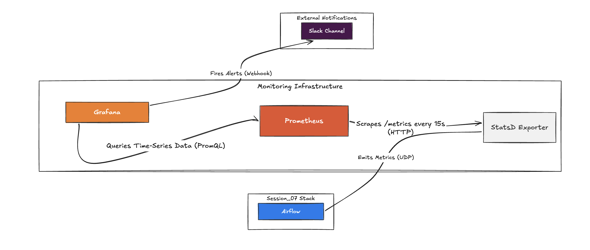

# Session 09 Demo — Monitoring, Alerting & Data Quality

Stack: Prometheus + StatsD Exporter + Grafana + Great Expectations + Slack Webhook + Airflow.

## Architecture

Session 09 runs as **two Docker Compose stacks** that talk over `host.docker.internal`:




```
session_07_security/    ← Airflow (webserver + scheduler + worker)  ─┐  emits StatsD
session_09_monitoring/  ← Prometheus + StatsD Exporter + Grafana    ←┘  host.docker.internal:8125
```

Airflow (in the session_07 stack) emits metrics via UDP to `host.docker.internal:8125`, which the
session_09 StatsD Exporter receives on its `8125:9125/udp` mapping:

```
Airflow → UDP → host.docker.internal:8125 → StatsD Exporter → Prometheus scrape (15s) → Grafana
```

The session_09 order-pipeline DAG is **deployed into the session_07 Airflow** (see
[Deploy the pipeline](#deploy-the-pipeline-into-session_07)), so its task runs emit the metrics the
dashboards visualize and its Great Expectations check drives the data-quality alert.

Both stacks must be up:

```bash
cd session_07_security   && docker compose up -d --build   # --build picks up GE + duckdb
cd session_09_monitoring && docker compose up -d
```

## 1. Start the monitoring stack

```bash
cd session_09_monitoring
docker compose up -d
docker compose ps
```

- Prometheus: `http://localhost:9090`
- Grafana: `http://localhost:3000` (admin/admin)
- StatsD Exporter metrics: `http://localhost:9102/metrics`

## 2. Configure Airflow to emit metrics via StatsD

Add to Airflow environment (docker-compose or airflow.cfg):

```yaml
AIRFLOW__METRICS__STATSD_ON: "True"
AIRFLOW__METRICS__STATSD_HOST: "statsd-exporter"
AIRFLOW__METRICS__STATSD_PORT: "8125"
AIRFLOW__METRICS__STATSD_PREFIX: "airflow"
```

This is an example how service expose metrics, you can visit this page [airflow metrics](https://airflow.apache.org/docs/apache-airflow/2.9.3/administration-and-deployment/logging-monitoring/metrics.html) to explore more metrics from Airflow.
Verify at `http://localhost:9090/targets` (this is Prometheus Services) — the `airflow` job must be UP.

## Deploy the pipeline into session_07

The session_07 Airflow mounts this session's DAG and installs its runtime deps (already wired):

- `session_07_security/docker-compose.yml` mounts `../session_09_monitoring/demo` →
  `/opt/airflow/dags/session_09` and `../plugins` → `/opt/airflow/plugins`.
- `session_07_security/Dockerfile` installs `great-expectations` + `duckdb` (rebuild with
  `docker compose up -d --build`).
- An `.airflowignore` in `demo/` keeps `data/` (which holds `generate_data.py`) out of DAG parsing.

After `--build`, the `session_09_order_pipeline` DAG appears in the session_07 Airflow UI.

## DuckDB warehouse — host access

The pipeline writes to the shared DuckDB warehouse at `session_07_security/db/dwh.duckdb`
(bind-mounted into the session_07 Airflow at `/opt/airflow/db/dwh.duckdb`). It is gitignored.
To inspect `bronze.orders_raw` / `gold.fact_orders` from your laptop, point **DBeaver** (or the
`duckdb` CLI) at that file while the DAG is **not** running (DuckDB is single-writer):

```bash
python3 -c "
import duckdb
con = duckdb.connect('session_07_security/db/dwh.duckdb', read_only=True)
print(con.execute('SELECT COUNT(*) FROM gold.fact_orders').fetchone())
con.close()
"
```

## 3. Grafana dashboards

Dashboards are auto-provisioned from `grafana/dashboards/` on startup — no manual import needed.

| Dashboard | What it shows |
|---|---|
| Airflow cluster dashboard | Scheduler heartbeat, dagbag size, executor queue, task success/fail |
| Airflow DAG dashboard | Per-DAG duration, schedule delay, task breakdown |

Metrics use the `af_agg_*` prefix (mapped by `statsd/statsd.yaml`). Key ones:

| Metric | What to look for |
|---|---|
| `af_agg_scheduler_heartbeat` | Must stay > 0; drop → scheduler dead |
| `af_agg_ti_failures` | Any increment → task failed |
| `af_agg_executor_queued_tasks` | Rising → executor bottleneck |
| `af_agg_dagrun_duration_success` | Spike → pipeline slowing down |

> Flow: Airflow → UDP → StatsD Exporter → HTTP → Prometheus scrape (15s) → Grafana pull.
> Debug right to left when a metric is missing.

Ref: https://github.com/databand-ai/airflow-dashboards

## 4. Grafana alerts

Five alert rules are auto-provisioned from `grafana/provisioning/alerting/alerts.yml` on startup —
no manual import needed. They appear in Grafana under **Alerting → Alert rules → DataOps Alerts**.

| Alert | Metric | Condition | Severity |
|---|---|---|---|
| DAG Task Failure | `af_agg_ti_failures` | increase 5m > 0 | critical |
| Scheduler Heartbeat Missing | `af_agg_scheduler_heartbeat` | increase 3m < 1, for 2m | critical |
| DAG Import Error | `af_agg_dag_processing_import_errors` | gauge > 0 | warning |
| Executor Queue Buildup | `af_agg_executor_queued_tasks` | gauge > 5, for 3m | warning |
| Zombie Tasks Detected | `af_agg_zombies_killed` | increase 10m > 0 | warning |

To wire Slack notifications: **Alerting → Contact points → + Add contact point**, type Slack,
paste your webhook URL. Then **Notification policies → Edit default policy** → set contact point.

When a DAG task fails → `af_agg_ti_failures` increments → Grafana alert fires within 1 minute.
The `ge_checkpoint_silver` task additionally sends a direct Slack alert with the list of failed
expectations before raising the exception.

## 5. Run the GE demo

The pipeline (`session_09_order_pipeline`) loads a parquet file into `bronze.orders_raw`,
transforms it to `silver.orders`, validates with the `orders_silver_suite`, then builds
`gold.fact_orders` and reconciles row counts. Which dataset it loads is controlled by the
Airflow Variable `orders_dataset` — set it to the full path of the parquet file. When the
Variable is absent the pipeline defaults to `/opt/airflow/dags/session_09/data/orders_clean.parquet`.

The sample parquet files are gitignored. Generate them once before triggering the DAG:

```bash
# Requires Python 3.11+
pip install -r session_09_monitoring/requirements.txt

cd session_09_monitoring/demo/data
python generate_data.py
# Creates (in this folder):
#   orders_clean.parquet  — 10,000 valid rows
#   orders_broken.parquet — 200 null customer_id, 150 negative amount, 10 duplicate order_id
```

Trigger the DAG; all 6 expectations pass on the clean dataset and the pipeline runs through
to `reconcile`. GE validation output is logged to the Airflow task log — no local files written.

## 6. GE Project Setup

```bash
cd session_09_monitoring/demo

# Initialize GE project — GE 0.18 creates gx/ by default, answer Y when prompted
great_expectations init

# Rename to great_expectations/
mv gx great_expectations

# Remove files not needed for this demo
rm -rf great_expectations/plugins                          # custom CSS — not used
rm -f  great_expectations/uncommitted/config_variables.yml # variable substitution — not used
```

After cleanup, the folder contains only what is needed:

```
great_expectations/
├── .gitignore                   # ignores uncommitted/ — auto-generated by GE
├── great_expectations.yml       # GE project config
├── expectations/
│   └── orders_silver_suite.json # expectation suite
└── uncommitted/                 # runtime output — gitignored
    ├── data_docs/local_site/    # HTML report generated after each DAG run
    └── validations/             # validation results (JSON)
```

To view the HTML report after a DAG run:

```bash
open session_09_monitoring/demo/great_expectations/uncommitted/data_docs/local_site/index.html
```

## 7. GE Expectation Suite

Suite: `great_expectations/expectations/orders_silver_suite.json` — 6 expectations:

| Expectation | Column | Rule |
|---|---|---|
| row_count_between | — | min 1 row |
| not_be_null | order_date | Date required |
| not_be_null | customer_name | Name required |
| be_between | amount | 20 – 4,000 (business range) |
| be_between | customer_id | 101 – 5,100 (valid customer range) |
| be_unique | order_id | No duplicates |

## Demo simplifications

- Slack webhook is a test URL — real deployment uses a proper channel with on-call rotation.
- GE context uses local filesystem — production uses a shared backend (S3 + shared Data Docs site).
- StatsD exporter runs as a sidecar — production typically uses the Prometheus push gateway or a managed metrics service.
