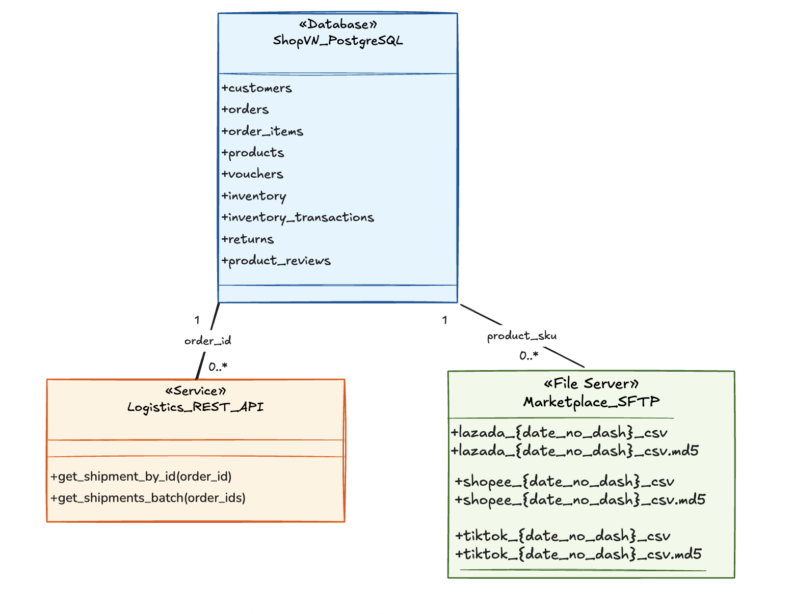
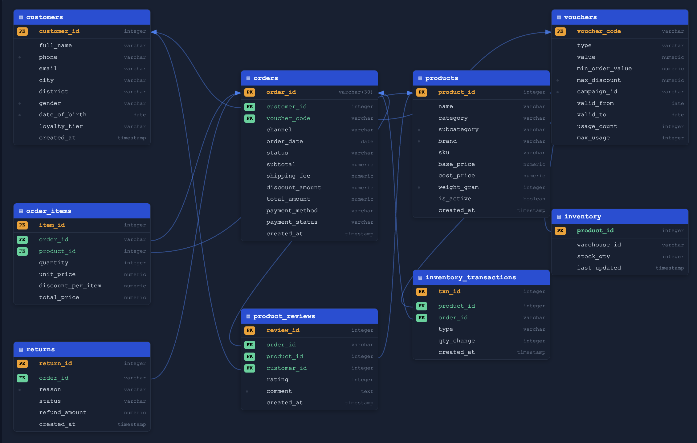

# ShopVN Dataset Guide

**Course**: Master Class DataOps for Modern Data Platforms

This document covers everything you need to know about the ShopVN dataset: what data is available, how the schemas are structured, how the three sources relate to each other, and how to get the environment running on your local machine.

---

## 1. Business Context

ShopVN is a Vietnamese e-commerce platform operating across two sales channels:

- **Direct channel** (70% of orders): customers buy directly via ShopVN's web and app
- **Marketplace channel** (30% of orders): customers buy through Lazada, Shopee, or TikTok

The dataset covers **30 days of transactions** from `2026-06-01` to `2026-06-30`, including two flash sale events on June 7 and June 15 that generate 2.5–3× the normal daily volume.

---

## 2. Three Data Sources


### Source 1 — PostgreSQL (OLTP Database)

The core transactional system for direct-channel orders. This is the **system of record** for customers, products, inventory, orders, and vouchers.

**Connection**:
```
Host:     localhost  |  Port: 5434
Database: shopvn
User:     shopvn_reader  (SELECT only)
Password: readonly123
```

### Source 2 — REST API (Logistics)

Provides shipment tracking data from GHN and GHTK carriers. This is the **only source** for: carrier identity, actual delivery dates, delivery attempts, failure reasons, and recipient province/district.

**Connection**:
```
Base URL: http://localhost:8000
Header:   X-API-Key: shopvn-logistics-key-2026
```

**Endpoints**:
```
GET /health
GET /v1/shipments/{order_id}
GET /v1/shipments?order_ids=id1,id2,...   (max 50 per request)
```

### Source 3 — SFTP (Marketplace Files)

**What is SFTP?**
SFTP (SSH File Transfer Protocol) is a secure file transfer protocol built on top of SSH. Unlike FTP, all data is encrypted in transit. In real-world data pipelines, SFTP is commonly used by partners (e.g. e-commerce marketplaces, banks, logistics providers) to deliver daily batch export files — typically CSVs — to your ingestion layer. Your pipeline connects to the SFTP server, lists available files, downloads them, validates integrity (checksum), then processes the data.

Daily sales export files from Lazada, Shopee, and TikTok. Each file covers one partner for one day. This is the **only source** for marketplace-channel revenue, platform commissions, and platform discounts.

**Connection**:
```
Host:     localhost  |  Port: 2222
User:     marketplace_reader
Password: sftp_readonly_2026
Path:     /marketplace/incoming/
```

---

## 3. PostgreSQL Schema

### 3.1 Entity Relationship Overview


### 3.2 Table Definitions

#### `customers`

Stores all registered customers. PII fields are present in source — must be masked before loading to analytics.

| Column | Type | Notes |
|--------|------|-------|
| `customer_id` | SERIAL PK | |
| `full_name` | VARCHAR | PII |
| `phone` | VARCHAR | PII — **~0.6% NULL** (intentional) |
| `email` | VARCHAR | PII |
| `city` | VARCHAR | |
| `district` | VARCHAR | |
| `ward` | VARCHAR | |
| `gender` | VARCHAR | male / female / other |
| `date_of_birth` | DATE | |
| `loyalty_tier` | VARCHAR | bronze / silver / gold / platinum |
| `created_at` | TIMESTAMP | |

---

#### `products`

Product catalog for ShopVN's direct channel.

| Column | Type | Notes |
|--------|------|-------|
| `product_id` | SERIAL PK | also JOIN KEY for SFTP |
| `name` | VARCHAR | |
| `category` | VARCHAR | 8 categories |
| `subcategory` | VARCHAR | brand name |
| `brand` | VARCHAR | |
| `sku` | VARCHAR UNIQUE | |
| `base_price` | DECIMAL | selling price |
| `cost_price` | DECIMAL | **~50 rows: cost > base** (intentional) |
| `weight_gram` | INT | |
| `is_active` | BOOLEAN | ~2% inactive |
| `created_at` | TIMESTAMP | |

---

#### `orders`

Central fact table. One row per order from the direct channel.

| Column | Type | Notes |
|--------|------|-------|
| `order_id` | VARCHAR PK | Format: `ORD-YYYYMMDD-XXXXX` — also API JOIN KEY |
| `customer_id` | INT FK → customers | |
| `voucher_code` | VARCHAR FK → vouchers | **nullable** — 70% of orders have no voucher |
| `channel` | VARCHAR | web / app |
| `order_date` | DATE | |
| `status` | VARCHAR | delivered / shipping / confirmed / cancelled / returned |
| `subtotal` | DECIMAL | sum of order_items |
| `shipping_fee` | DECIMAL | **~2% = 0** (intentional — no freeship voucher) |
| `discount_amount` | DECIMAL | **~0.3% > subtotal** (intentional — flash sale bug) |
| `total_amount` | DECIMAL | subtotal + shipping_fee − discount_amount |
| `payment_method` | VARCHAR | cod / momo / banking / card |
| `payment_status` | VARCHAR | pending / paid / failed / refunded |
| `created_at` | TIMESTAMP | |

---

#### `order_items`

Line items for each order. One row per product per order.

| Column | Type | Notes |
|--------|------|-------|
| `item_id` | SERIAL PK | |
| `order_id` | VARCHAR FK → orders | |
| `product_id` | INT FK → products | |
| `quantity` | INT | **~1% = 0** — item was cancelled at line-item level; old system set quantity to 0 instead of deleting the row |
| `unit_price` | DECIMAL | price at time of order |
| `discount_per_item` | DECIMAL | flash sale item-level discount |
| `total_price` | DECIMAL | (unit_price − discount_per_item) × quantity |

---

#### `vouchers`

Discount codes used in orders.

| Column | Type | Notes |
|--------|------|-------|
| `voucher_code` | VARCHAR PK | |
| `type` | VARCHAR | value / percent |
| `value` | DECIMAL | amount or percentage |
| `min_order_value` | DECIMAL | minimum order to apply |
| `max_discount` | DECIMAL | cap for percent-type vouchers |
| `campaign_id` | VARCHAR | BIRTHDAY / SUMMER2026 / WEEKEND / NEWUSER / FLASHSALE / LOYALTY |
| `valid_from` | DATE | |
| `valid_to` | DATE | |
| `usage_count` | INT | |
| `max_usage` | INT | |

---

#### `inventory`

Current stock level per product. 1:1 with `products`.

| Column | Type | Notes |
|--------|------|-------|
| `product_id` | INT PK FK → products | |
| `warehouse_id` | VARCHAR | |
| `stock_qty` | INT | current quantity — reconstruct history from `inventory_transactions` |
| `last_updated` | TIMESTAMP | |

---

#### `inventory_transactions`

Audit log of every stock movement. Use this to reconstruct end-of-day inventory for any past date.

| Column | Type | Notes |
|--------|------|-------|
| `txn_id` | SERIAL PK | |
| `product_id` | INT FK → products | |
| `order_id` | VARCHAR FK → orders | nullable |
| `type` | VARCHAR | reserve / release / sold / restock |
| `qty_change` | INT | negative = stock decrease |
| `created_at` | TIMESTAMP | |

---

#### `returns`

Return requests for delivered orders.

| Column | Type | Notes |
|--------|------|-------|
| `return_id` | SERIAL PK | |
| `order_id` | VARCHAR FK → orders | |
| `reason` | VARCHAR | |
| `status` | VARCHAR | pending / approved / rejected / refunded |
| `refund_amount` | DECIMAL | |
| `created_at` | TIMESTAMP | |

---

#### `product_reviews`

Customer reviews submitted after delivery.

| Column | Type | Notes |
|--------|------|-------|
| `review_id` | SERIAL PK | |
| `order_id` | VARCHAR FK → orders | |
| `product_id` | INT FK → products | |
| `customer_id` | INT FK → customers | |
| `rating` | INT | 1–5 |
| `comment` | TEXT | nullable — ~40% of reviews are rating-only |
| `created_at` | TIMESTAMP | |

---

### 3.3 Cross-Source Relationships

```
PostgreSQL.orders.order_id
    └── API.shipments.order_id          (LEFT JOIN — ~8% will have no shipment)

PostgreSQL.products.product_id
    └── SFTP.shopvn_product_id          (LEFT JOIN — product-level only)
```

**Important**: `SFTP.external_order_id` (e.g. `LAZADA-20260601-000001`) has **no relationship** to `PostgreSQL.orders.order_id` (e.g. `ORD-20260601-00001`). These are two completely separate order systems. You can only join at the product level.

---

## 4. REST API Schema

### 4.1 Shipment Response

```json
{
  "order_id":                "ORD-20260601-00001",
  "carrier":                 "ghn",
  "tracking_code":           "GHN202676602",
  "status":                  "delivered",
  "actual_shipping_fee":     20000,
  "shipped_at":              "2026-06-01T18:00:00+07:00",
  "actual_delivery_date":    "2026-06-02T10:26:00+07:00",
  "estimated_delivery_date": "2026-06-03",
  "recipient_province":      "Hà Nội",
  "recipient_district":      "Đống Đa",
  "delivery_attempts":       1,
  "failure_reason":          null
}
```

**Status values**: `picked_up` · `in_transit` · `delivered` · `failed` · `returned`
**Failure reasons** (when status = failed): `not_at_home` · `wrong_address` · `refused` · `phone_off` · `cannot_locate`
**Carriers**: `ghn` · `ghtk`

### 4.2 Batch Response

```json
{
  "shipments": [ { ... }, { ... } ],
  "count": 42,
  "not_found": ["ORD-20260601-00010", "ORD-20260601-00050"],
  "not_found_count": 2
}
```

### 4.3 Error Responses

| HTTP | Error key | When |
|------|-----------|------|
| 401 | `invalid_api_key` | Missing or wrong API key |
| 400 | `batch_size_exceeded` | >50 order IDs in one request |
| 404 | `shipment_not_found` | Order cancelled or 404-injection (~8%) |
| 429 | `rate_limit_exceeded` | >100 requests/minute — includes `retry_after` seconds |
| 500 | `internal_server_error` | Random 1% failure injection |

---

## 5. SFTP File Schema

### 5.1 Directory Structure

```
/marketplace/incoming/
├── lazada/
│   ├── lazada_20260601.csv
│   ├── lazada_20260601.csv.md5
│   ├── lazada_20260602.csv
│   ├── lazada_20260602.csv.md5
│   └── ... (up to 30 days)
├── shopee/   (same structure)
└── tiktok/   (same structure)
```

Total: up to 90 CSV + 90 MD5 = 180 files. In practice 3 days × 1 partner file will be missing.

### 5.2 CSV Columns

| Column | Type | Description |
|--------|------|-------------|
| `external_order_id` | string | Order ID on the platform (e.g. `LAZADA-20260601-000001`) |
| `shopvn_product_id` | int | **JOIN KEY** → `products.product_id` |
| `seller_sku` | string | SKU as listed on the platform |
| `partner` | string | lazada / shopee / tiktok |
| `order_date` | YYYY-MM-DD | |
| `quantity_sold` | int | |
| `sale_price` | int (VND) | after platform discount |
| `platform_discount` | int (VND) | discount applied by platform (not by ShopVN) |
| `commission_rate` | decimal | e.g. 0.08 = 8% |
| `net_revenue` | int (VND) | = sale_price × quantity × (1 − commission_rate) |
| `settlement_date` | YYYY-MM-DD | = order_date + 15 days (T+15 payment cycle) |
| `status` | string | completed / returned / disputed |

### 5.3 File Sizes

| Partner | Normal day | Flash sale (Jun 7 & 15) |
|---------|-----------|------------------------|
| Lazada | 200–400 KB | 8–12 MB |
| Shopee | 350–600 KB | 12–18 MB |
| TikTok | 150–300 KB | 6–10 MB |

### 5.4 Checksum Files

Every CSV has a companion `.md5` file containing the MD5 hash of the CSV. You must verify this before processing:

```python
import hashlib

def verify_checksum(csv_path: str, md5_path: str) -> bool:
    with open(md5_path) as f:
        expected = f.read().strip()
    md5 = hashlib.md5()
    with open(csv_path, "rb") as f:
        for chunk in iter(lambda: f.read(8192), b""):
            md5.update(chunk)
    return md5.hexdigest() == expected
```

---

## 6. Intentional Failures

All failures listed below are **by design**. For the required handling of each failure, see `01_project_requirements.md` Section 5.

### 6.1 PostgreSQL — Data Quality Issues

| Issue | Column | Rate | Notes |
|-------|--------|------|-------|
| NULL phone number | `customers.phone` | ~0.6% | Optional field — some customers registered without providing a phone number. Valid data, not a bug. |
| Zero shipping fee | `orders.shipping_fee` | ~2% | Freeship should have been applied via voucher but wasn't — missing business rule enforcement in source system. |
| Discount > subtotal | `orders.discount_amount` | ~0.3% | Flash sale bug — discount calculation in source system did not cap at subtotal, resulting in negative `total_amount`. |
| Zero quantity | `order_items.quantity` | ~1% | Legacy system behaviour — cancelled line items were zeroed out instead of deleted. |
| Cost > base price | `products.cost_price` | 50 rows | Data entry error — cost price was entered incorrectly. Product is being sold at a loss. |

### 6.2 REST API — Injected Failures

| Failure | Rate | Notes |
|---------|------|-------|
| Rate limit (HTTP 429) | >100 req/min | API enforces a 100 req/min cap to protect carrier backend systems. Response includes a `retry_after` field. |
| Timeout (35s sleep) | 5% of requests | Carrier API occasionally hangs on slow tracking lookups. Failure is non-deterministic — same request may succeed on retry. |
| Not found (HTTP 404) | ~8% of order IDs — deterministic per `order_id` | Order was cancelled before shipment was created, so no tracking record exists. Same `order_id` always returns 404. |
| Server error (HTTP 500) | 1% | Random transient failure — simulates carrier API instability. Not related to the request content. |
| Batch too large (HTTP 400) | >50 IDs | Client-side bug — pipeline is sending more IDs than the API allows per request. |

### 6.3 SFTP — File Failures

| Failure | Count | Notes |
|---------|-------|-------|
| Missing file | 3 days × 1 partner | Partner did not upload the export file for that day — could be a partner-side generation failure or upload error. |
| Corrupt file | 2 days × 1 partner | File was partially uploaded or corrupted in transit. MD5 checksum will not match the companion `.md5` file. |
| Late arrival | 2 days × 1 partner | Partner uploaded the file after the pipeline's scheduled run time — conceptual only, see `01_project_requirements.md` Section 5.3. |

**FAILURE_MANIFEST.txt** is a reference file pre-baked into the SFTP server at `/marketplace/incoming/FAILURE_MANIFEST.txt`. It lists exactly which days and partners have injected failures, so you know what to expect when testing your pipeline:

```
2026-06-04  tiktok    MISSING
2026-06-11  tiktok    MISSING
2026-06-17  lazada    MISSING
2026-06-09  tiktok    CORRUPT
2026-06-23  tiktok    CORRUPT
2026-06-18  tiktok    LATE
2026-06-24  tiktok    LATE
```

Use this file to:
- Verify your pipeline correctly detects and handles each failure type
- Reference exact dates when writing your runbook scenarios
- Confirm your pipeline logs the right warning/alert for each case

Download it with:
```bash
sftp -P 2222 marketplace_reader@localhost
sftp> get /marketplace/incoming/FAILURE_MANIFEST.txt .
sftp> exit
```

---

## 7. Setup & Installation

### 7.1 About This Docker Compose

The `docker-compose.yml` in this folder starts **only the three data source containers** — PostgreSQL, the Logistics API, and the SFTP server. It does **not** include your pipeline stack (Airflow, DWH, etc.).

You will create a **separate `docker-compose.yml`** for your pipeline (Airflow, DWH, etc.).

When the datasource `docker-compose.yml` starts, Docker automatically creates a network called `shopvn-net` and places the three source containers on it. Your pipeline containers need to join this same network to reach those sources.

Here is a minimal example of an Airflow pipeline `docker-compose.yml` that connects to the ShopVN sources:

```yaml
# pipeline/docker-compose.yml
networks:
  shopvn-net:
    external: true  # this network was created by the datasource compose — reuse it

services:
  airflow:
    image: apache/airflow:2.9.3
    networks:
      - shopvn-net  # join the same network as postgres, api, sftp
    environment:
      # Connect to ShopVN PostgreSQL using the service name "postgres", not localhost
      SHOPVN_DB_HOST: postgres
      SHOPVN_DB_PORT: 5432
      SHOPVN_DB_USER: shopvn_reader
      SHOPVN_DB_PASSWORD: readonly123
      SHOPVN_DB_NAME: shopvn

      # Logistics API — use service name "api"
      LOGISTICS_API_URL: http://api:8000
      LOGISTICS_API_KEY: shopvn-logistics-key-2026

      # SFTP — use service name "sftp"
      SFTP_HOST: sftp
      SFTP_PORT: 22
      SFTP_USER: marketplace_reader
      SFTP_PASSWORD: sftp_readonly_2026
    volumes:
      - ./dags:/opt/airflow/dags
```

Inside the Airflow container, the three sources are reachable at:

| Source | Address inside container |
|--------|--------------------------|
| PostgreSQL | `postgres:5432` |
| Logistics API | `http://api:8000` |
| SFTP | `sftp:22` |

> The ports `5434`, `8000`, `2222` are **host-side** port mappings — they only work when connecting from your laptop directly. Inside any Docker container, always use the service names and their internal ports above.

### 7.2 Prerequisites

| Tool | Version |
|------|---------|
| Docker | 24+ |
| Docker Compose | v2 |
| RAM available for Docker | ≥ 4 GB |
| Free disk space | ≥ 3 GB |

### 7.3 Start the Data Sources

```bash
# From the session_11_final_project directory
docker compose up -d

# Check that all three containers are running
docker compose ps
```

Expected output:
```
NAME                           STATUS           PORTS
masterclass-dataops-api        Up               0.0.0.0:8000->8000/tcp
masterclass-dataops-postgres   Up (healthy)     0.0.0.0:5434->5432/tcp
masterclass-dataops-sftp       Up               0.0.0.0:2222->22/tcp
```

> PostgreSQL restores ~200,000 rows from a pre-built dump on first start. This takes about **60 seconds**. The container will show `(healthy)` once it is ready.

### 7.4 Verify Each Source

```bash
# PostgreSQL — total order count
psql -h localhost -p 5434 -U shopvn_reader -d shopvn \
  -c "SELECT COUNT(*) FROM orders;"
# Expected: ~210,000

# Flash sale volume check
psql -h localhost -p 5434 -U shopvn_reader -d shopvn \
  -c "SELECT order_date, COUNT(*) FROM orders
      WHERE order_date IN ('2026-06-01','2026-06-07')
      GROUP BY order_date;"
# Expected: ~5,000-7,000 on Jun 1 vs ~15,000-18,000 on Jun 7

# API health
curl http://localhost:8000/health
# Expected: {"status":"ok","timestamp":"..."}

# API single shipment
curl -H "X-API-Key: shopvn-logistics-key-2026" \
  "http://localhost:8000/v1/shipments/ORD-20260601-00001"
# Expected: JSON with carrier, status, delivery dates

# SFTP — list files
sftp -P 2222 marketplace_reader@localhost
sftp> ls /marketplace/incoming/lazada/
# Expected: ~27-29 CSV files (not 30 — some are intentionally missing)
sftp> get /marketplace/incoming/FAILURE_MANIFEST.txt .
sftp> exit
cat FAILURE_MANIFEST.txt
# Shows exactly which days/partners have failures
```

### 7.5 Stop and Reset

```bash
# Stop services (keep data)
docker compose stop

# Stop and remove containers (keep data volumes)
docker compose down

# Full reset — delete all data and start fresh
docker compose down && docker compose up -d
# Note: PostgreSQL will re-initialize from dump (~60 seconds)
```

### 7.6 Docker Images

All images are published on Docker Hub under `anhnguyen1611/`:

| Image | Description |
|-------|-------------|
| `anhnguyen1611/masterclass-dataops-postgres:latest` | PostgreSQL 16 with pre-seeded ShopVN data |
| `anhnguyen1611/masterclass-dataops-api:latest` | FastAPI logistics service |
| `anhnguyen1611/masterclass-dataops-sftp:latest` | SFTP server with marketplace files baked in |

---

## 8. What Only Lives in Each Source

This is a critical point for pipeline design. Use the right source for the right question.

| Data | PostgreSQL | API | SFTP |
|------|-----------|-----|------|
| Order revenue (direct) | ✅ | ❌ | ❌ |
| Customer demographics | ✅ | ❌ | ❌ |
| Product catalog | ✅ | ❌ | ❌ |
| Voucher / campaign data | ✅ | ❌ | ❌ |
| Return / refund history | ✅ | ❌ | ❌ |
| **Carrier (GHN vs GHTK)** | ❌ | ✅ | ❌ |
| **Actual delivery date** | ❌ | ✅ | ❌ |
| **Delivery attempts** | ❌ | ✅ | ❌ |
| **Failure reason** | ❌ | ✅ | ❌ |
| **Recipient province** | ❌ | ✅ | ❌ |
| **Marketplace revenue** | ❌ | ❌ | ✅ |
| **Commission cost** | ❌ | ❌ | ✅ |
| **Platform discount** | ❌ | ❌ | ✅ |
| **Settlement date (T+15)** | ❌ | ❌ | ✅ |

---

## 9. Key Business Rules

### Direct Channel Revenue

`total_amount` is pre-calculated by the source system and stored in the `orders` table. When `discount_amount > subtotal`, the source system clamps `total_amount` to `0` instead of allowing a negative value.

### Marketplace Net Revenue

`net_revenue` is pre-calculated and stored in each SFTP CSV row. The formula used by the source system is:

```
net_revenue = floor(sale_price × quantity_sold × (1 − commission_rate))
```

### Return / Refund Impact on Revenue

Only returns with `status = 'refunded'` are deducted from revenue — money has actually been returned to the customer at this point. `approved` returns are not counted until funds are disbursed.

```
net_revenue_after_return = total_amount - SUM(refund_amount WHERE status = 'refunded')
```

### Settlement Lag

Marketplace platforms pay on a T+15 cycle:

```
settlement_date = order_date + 15 days
```

Revenue is **earned** on `order_date` but **received** on `settlement_date`. Your data model must store **both columns** so Finance can query either view:

- Revenue earned in June → filter by `order_date`
- Cash actually received in June → filter by `settlement_date`

These two numbers will differ — both are valid depending on the reporting purpose.

### Inventory Reconstruction

The `inventory` table only stores the **current** stock level — it always reflects today's state, not history. To get end-of-day stock for a past date, reconstruct it from `inventory_transactions`:

```sql
-- This is how to get Stock at end of 2026-06-15 for a given product
SELECT
  stock_qty
  - COALESCE(SUM(qty_change) FILTER (WHERE created_at > '2026-06-15 23:59:59'), 0)
  AS stock_on_2026_06_15
FROM inventory
LEFT JOIN inventory_transactions USING (product_id)
WHERE product_id = 123
GROUP BY stock_qty;
```

Your pipeline must run this reconstruction **daily** and write the result as a snapshot into your DWH — you cannot query `inventory` directly for historical data. The analytics table should look like:

| snapshot_date | product_id | stock_qty |
|---------------|-----------|-----------|
| 2026-06-14 | 1 | 2,850 |
| 2026-06-15 | 1 | 2,711 |
| 2026-06-16 | 1 | 2,540 |

### Sell-Through Rate

```
avg_daily_units_sold = SUM(quantity_sold over last 7 days) / 7
days_to_stockout     = current_stock / avg_daily_units_sold
```

> If the 7-day window includes a flash sale day (Jun 7 or Jun 15), `avg_daily_units_sold` will be inflated ~3×, causing `days_to_stockout` to be underestimated.

### Loyalty Tier History

The `customers` table only stores the **current** loyalty tier. Historical changes cannot be backfilled. SCD Type 2 tracking of tier changes is only possible from the day your pipeline starts running.

---

## 10. Design Decisions & Rationale

Every non-trivial decision in your pipeline must be accompanied by a short explanation of **why** — not just what. This applies to:

- Data quality handling (e.g. "cap discount at subtotal because negative revenue corrupts Finance reports")
- Load strategy (e.g. "MERGE instead of truncate+insert because we need idempotency without losing in-flight records")
- Retry policy (e.g. "exponential backoff starting at 1s because the API `retry_after` header is unreliable under load")
- SCD type chosen (e.g. "SCD Type 2 for loyalty tier because Marketing needs to segment customers by their tier *at time of purchase*")
- DQ thresholds (e.g. "alert if row count drops >10% day-over-day — flash sale days excluded from baseline")

Document these decisions inline in your code (comments), in your DAG, or in a `decisions.md` file in your repository. A pipeline that works but cannot be reasoned about by the next engineer is incomplete.

---

## 11. Getting Started

For project structure, refer to the pipeline repositories from previous sessions as a starting point. You are free to adapt the layout to fit your chosen stack.
