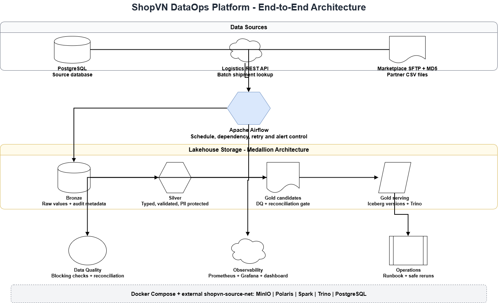

# Data Platform — Design Document

**Date**: _YYYY-MM-DD_

---

## Table of Contents

1. [Context](#1-context)
2. [Problem Statement](#2-problem-statement)
3. [Solution Overview](#3-solution-overview)
4. [High Level Design](#4-high-level-design)
5. [Low Level Design](#5-low-level-design)
   - [5.1 Data Model](#51-data-model)
   - [5.2 Extract Layer](#52-extract-layer)
   - [5.3 Transform Layer](#53-transform-layer)
   - [5.4 Load Layer](#54-load-layer)
   - [5.5 Orchestration (Airflow)](#55-orchestration-airflow)
   - [5.6 Technology Config](#56-technology-config)
   - [5.7 Schema Evolution Strategy](#57-schema-evolution-strategy)
   - [5.8 Failure Handling](#58-failure-handling)
6. [Monitoring & Alerting](#6-monitoring--alerting)
7. [Runbook](#7-runbook)
8. [Trade-offs & Alternatives Considered](#8-trade-offs--alternatives-considered)

---

## 1. Context

> Describe the business background, who the stakeholders are, and why this platform is being built.

- **Company**: ShopVN — Vietnamese e-commerce platform, two sales channels: direct (web/app) and marketplace (Lazada, Shopee, TikTok)
- **Stakeholders**: Finance, Operations, Marketing, Product teams
- **Current state**: Data is scattered across 3 isolated systems (PostgreSQL, Logistics API, SFTP). No team has a complete picture.
- **Goal**: Build a centralized analytics platform. Data must be available to all teams before **8:00 AM every day**.

---

## 2. Problem Statement

> State the specific problems this design is solving. Be concrete.

- _[Problem 1] e.g. Finance cannot reconcile direct vs marketplace revenue because data lives in two separate systems_
- _[Problem 2] e.g. Operations cannot measure carrier performance because shipment data is only accessible via API, not stored anywhere_
- _[Problem 3] e.g. No automated data quality checks — corrupted files and buggy source data go undetected_
- _[Problem 4] e.g. No SLA enforcement — pipeline failures are discovered when business teams report missing data_

---

## 3. Solution Overview

> One paragraph describing your approach. Then justify your stack choice.

_[Describe your overall approach in 3–5 sentences]_

### Stack Choice

| Option | Chosen? | Justification |
|--------|---------|---------------|
| DuckDB (SQL DWH) | ✅ / ❌ | _[Why you chose or rejected this]_ |
| Lakehouse (Spark + Delta/Iceberg) | ✅ / ❌ | _[Why you chose or rejected this]_ |

### High-Level Data Flow

```
[PostgreSQL]  ──┐
[REST API]    ──┼──► Airflow DAGs ──► Transform ──► DWH/Lakehouse ──► Analytics
[SFTP]        ──┘
```

> Replace with your actual architecture diagram.

---

## 4. High Level Design

### 4.1 Architecture Diagram



*Define HLD and add it to images/architecture.png path.*


### 4.2 Component Overview

| Component | Technology | Role |
|-----------|-----------|------|
| Orchestration | Apache Airflow | DAG scheduling, retry, SLA alerting |
| Extract | _Python / PySpark_ | Pull data from PostgreSQL, API, SFTP |
| Transform | _SQL / PySpark_ | Apply business rules, DQ checks, PII masking |
| Storage | _DuckDB / Delta Lake_ | Analytics-ready tables |
| Monitoring | _Prometheus + Grafana_ | Pipeline metrics and alerting |
| CI/CD | _GitHub Actions_ | Automated test and deploy |

### 4.3 Docker Networking

> The datasource containers (PostgreSQL, API, SFTP) run on the `shopvn-net` Docker network. Your pipeline containers must join this network.

```yaml
# Your pipeline docker-compose.yml
networks:
  shopvn-net:
    external: true

services:
  airflow:
    networks:
      - shopvn-net
    environment:
      SHOPVN_DB_HOST: postgres   # service name, not localhost
      LOGISTICS_API_URL: http://api:8000
      SFTP_HOST: sftp
```

_Rationale: [explain why you chose this networking approach]_

---

## 5. Low Level Design

### 5.1 Data Model
> Mô tả các analytics tables: tên bảng, grain (1 row = 1 cái gì?), load strategy, phục vụ UC nào. Kèm ERD của analytics layer.

_[your design]_

---

### 5.2 Extract Layer
> Mô tả cách kết nối và extract từng source: PostgreSQL (full load hay incremental?), API (batch size, retry policy, rate limit handling), SFTP (checksum verification, stream reading, failure handling).

_[your design]_

---

### 5.3 Transform Layer
> Mô tả business rules được apply ở bước nào, DQ checks chạy trước load như thế nào, PII masking thực hiện ra sao và tại bước nào.

_[your design]_

---

### 5.4 Load Layer
> Mô tả load strategy cho từng bảng (MERGE / append / snapshot), idempotency key, partition scheme. Giải thích lý do chọn strategy đó.

_[your design]_

---

### 5.5 Orchestration (Airflow)
> Mô tả cấu trúc DAG (per source hay per layer?), schedule, retry config, SLA config, task dependencies. Mọi config cần có rationale.

_[your design]_

---

### 5.6 Technology Config
> Mô tả config cụ thể của stack bạn chọn: Airflow connections/pools, DuckDB schema + concurrent access strategy (nếu Option A), hoặc Spark executor config + partition strategy (nếu Option B). Credential management — không hardcode.

_[your design]_

---

### 5.7 Schema Evolution Strategy
> Mô tả cách pipeline xử lý khi source schema thay đổi: thêm cột mới, đổi kiểu dữ liệu, thêm SFTP partner mới.

_[your design]_

---

### 5.8 Failure Handling
> Mô tả cách xử lý từng loại failure: PostgreSQL DQ issues, API errors (429 / timeout / 404 / 500 / 400), SFTP failures (missing / corrupt / late). Tham khảo `01_project_requirements.md` Section 5 để biết danh sách đầy đủ.

_[your design]_

### 5.9 You can add other sections if necessary for you presentation.

---

## 6. Monitoring & Alerting

### 6.1 Three Monitoring Levels

| Level | What to monitor | Tool |
|-------|----------------|------|
| **Infrastructure** | Host/container health (CPU, memory, disk, container up/down) | _[your choice]_ |
| **Service / Application** | Internal platform health — Airflow scheduler, MinIO, Spark, DuckDB, etc. | _[your choice]_ |
| **Job** | DAG success/fail, task duration, DQ check results, record counts | _[your choice]_ |

> For each level: what tool, how alerts are routed, and how fast incidents are detected.

_[your design]_

### 6.2 Alert Routing

> Who gets alerted, via what channel, within how long?

_[your design]_

### 6.3 Dashboard _(Nice to Have)_

> A single view that lets on-call answer the 3 questions in Section 4.5 without SSH. Tool is your choice — Airflow UI, Grafana, or anything equivalent.

_[your design]_

---

## 7. Runbook

> Mô tả ít nhất 3 failure scenarios. Mỗi scenario cần có: cách detect, assess impact, fix, rerun an toàn, và verify sau rerun. Tham khảo `01_project_requirements.md` Section 4.6 để biết yêu cầu cụ thể.

### Scenario 1 — _[tên scenario]_

_[your runbook link]_

---

### Scenario 2 — _[tên scenario]_

_[your runbook link]_

---

### Scenario 3 — _[tên scenario]_

_[your runbook link]_

---

## 8. Trade-offs & Alternatives Considered

> For each major decision, document what else you considered and why you chose what you did.

| Decision | Option chosen | Alternatives considered | Rationale |
|----------|--------------|------------------------|-----------|
| Stack | _[DuckDB / Lakehouse]_ | _[the other one]_ | _[your reasoning]_ |
| Load strategy | MERGE | Truncate + insert / Append | _[why MERGE — idempotency without full reload]_ |
| PII masking method | _[hash / mask / drop]_ | _[others]_ | _[why]_ |
| DAG structure | _[per source / per layer]_ | _[the other]_ | _[why]_ |
| Retry policy | Exponential backoff | Fixed interval | _[why exponential]_ |
| SCD Type 2 for loyalty tier | SCD Type 2 | SCD Type 1 | _[why — need history for segmentation at purchase time]_ |
| _[add your own]_ | | | |
