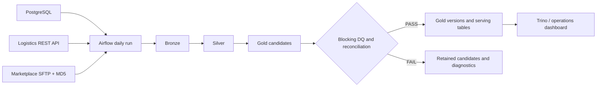

# Data Platform — Design Document

**Date**: 2026-08-17  
**Owner**: ShopVN Data Platform  
**Business stewards**: Finance, Operations, Customer & Marketing, Product

## Table of Contents

1. [Context](#1-context)
2. [Problem Statement](#2-problem-statement)
3. [Solution Overview](#3-solution-overview)
4. [High Level Design](#4-high-level-design)
5. [Low Level Design](#5-low-level-design)
6. [Monitoring & Alerting](#6-monitoring--alerting)
7. [Runbook](#7-runbook)
8. [Trade-offs & Alternatives Considered](#8-trade-offs--alternatives-considered)

## 1. Context

ShopVN sells through web/app and marketplace channels including Lazada, Shopee, and
TikTok. Finance, Operations, Marketing, and Product currently rely on separate
PostgreSQL, logistics API, and SFTP exports. The platform provides governed daily
analytics before 08:00 in `Asia/Ho_Chi_Minh`, including the specified flash-sale peak.

## 2. Problem Statement

- Finance cannot reconcile direct sales, marketplace proceeds, returns, discounts, and
  commissions under one controlled definition.
- Operations lacks a durable carrier-performance dataset and needs orders without a
  shipment record retained for investigation.
- Marketing and Product lack reliable customer lifecycle, voucher, channel-performance,
  review, and end-of-day inventory data.
- Source outages, corrupt partner files, schema drift, and anomalous source rows must
  not silently contaminate published metrics.

## 3. Solution Overview

One daily Airflow DAG executes source-specific PySpark Bronze ingestion, model-scoped
Silver transformations, and candidate Gold models. Iceberg tables are stored in MinIO
through Polaris; only candidates that pass blocking DQ and reconciliation are copied to
Gold version history and Trino-serving tables. This separates source failure handling
from publication and makes reruns auditable and deterministic.

### Stack Choice

| Option | Chosen? | Justification |
|---|---:|---|
| DuckDB SQL DWH | No | Appropriate for a small standalone mart, but does not meet the selected Lakehouse exercise for shared Spark/Trino reads and controlled schema evolution. |
| Spark + Apache Iceberg | Yes | Supports typed transforms, Iceberg MERGE, snapshots, partitioned history, and a shared catalog without introducing a distributed cluster. |

### High-Level Data Flow

## 4. High Level Design

### 4.1 Architecture Diagram

The diagram shows the three source boundaries, Airflow orchestration, the
Bronze/Silver/Gold publication flow, data-quality gate, operational controls, and the
local infrastructure services.

The editable Draw.io source is [architecture.drawio](images/architecture.drawio).

### 4.2 Component Overview

| Component | Technology | Role |
|---|---|---|
| Orchestration | Airflow 2.9.3 | Scheduling, dependencies, retries, backfills, SLA state |
| Compute | PySpark 3.5.1 | Ingestion and model-scoped transformations |
| Table format | Apache Iceberg 1.10.1 | Atomic table commits, MERGE, snapshots, schema checks |
| Catalog and storage | Polaris 1.7.0 and MinIO | Iceberg metadata and object storage |
| Serving | Trino 483 | Read-only SQL over validated Gold tables |
| Observability | Airflow, Prometheus, Grafana, Streamlit | Task state, component health, audit and DQ visibility |

### 4.3 Docker Networking

Pipeline services use an internal `pipeline-net`. Airflow and Spark also attach to the
external source network named by `SHOPVN_SOURCE_NETWORK`, so the source services are
reached by Compose service name rather than `localhost`. All deployment-time addresses
and credentials are supplied through the validated environment configuration; none are
embedded in transformation code.

### 4.4 Local Access Endpoints

The following addresses are for the local Docker Compose environment only. They are
published host ports, not values used by application code or production deployment.

| Component | Local address | Purpose |
|---|---|---|
| Source PostgreSQL | `localhost:5434` | Course source database; pipeline connects through the Docker service network |
| Logistics API | `http://localhost:8000` | Source API contract and health checks |
| Marketplace SFTP | `localhost:2222` | Source file delivery endpoint |
| MinIO API | `http://localhost:9000` | Local S3-compatible object storage API |
| MinIO Console | `http://localhost:9001` | Local object-store inspection |
| Polaris | `http://localhost:8181` | Iceberg REST catalog endpoint |
| Polaris management | `http://localhost:8182` | Catalog readiness and administration endpoint |
| Trino | `http://localhost:8080` | Read-only analytical SQL endpoint |
| Airflow | `http://localhost:8081` | DAG scheduling, task state, and logs |
| Operations dashboard | `http://localhost:8501` | Read-only operational, DQ, and reconciliation view |
| Prometheus | `http://localhost:9090` | Metrics and alert input |
| Grafana | `http://localhost:3000` | Metrics dashboards and service health |

## 5. Low Level Design

### 5.1 Data Model

| Model | Grain | Business key | Load strategy | Primary use |
|---|---|---|---|---|
| `fact_daily_revenue` | date × source × channel | `metric_date, source_type, channel` | MERGE | Revenue and settlement reporting |
| `fact_customer_daily` | date × customer | `metric_date, customer_id` | MERGE | Lifecycle and customer value |
| `fact_voucher_daily` | date × voucher | `metric_date, voucher_code` | MERGE | Campaign performance |
| `fact_delivery_daily` | date × carrier × province × failure reason | dimensional tuple | MERGE | Carrier operations |
| `fact_return_daily` | date × category × channel | dimensional tuple | MERGE | Return rate |
| `fact_product_rating_daily` | date × category × direct channel | dimensional tuple | MERGE | Product quality |
| `fact_inventory_eod` | date × product × warehouse | dimensional tuple | MERGE | Inventory position |
| `fact_product_channel_daily` | date × product × channel | dimensional tuple | MERGE | Product and channel performance |
| `dim_customer_scd2` | customer × effective version | `customer_id, valid_from` | MERGE | Forward-only tier/location history |

Model schemas, nullability, owners, DQ thresholds, and breaking-change policy are
reviewed in `pipeline/contracts/`.

### 5.2 Extract Layer

- PostgreSQL is read as a full snapshot of the nine small course tables through a
  read-only account. Source keys and deterministic row hashes provide replay identity.
- The logistics API accepts batches of up to 50 order IDs. The client enforces 95
  requests per minute, honors 429 retry hints, retries timeouts with bounded backoff,
  retries a 500 once, records 404 as an expected missing shipment, and fails closed on
  invalid requests or authentication errors.
- SFTP files are streamed to a temporary path, checked against the required MD5,
  validated for required CSV headers, then atomically promoted and recorded in a
  manifest. Missing files are audited as late/incomplete; checksum or format failures
  are quarantined and fail the dependent branch.
- Bronze preserves source identity, extraction time, event-time fields where present,
  run ID, API/file batch identity, and a stable payload hash.

### 5.3 Transform Layer

Silver applies explicit type conversions, deterministic deduplication, and model-level
validation. Full name, phone, and email are salted SHA-256 hashes before Silver; ward
and review free text are not propagated. Discount-above-subtotal and zero-shipping rows
remain traceable but are flagged; zero quantity remains traceable and contributes zero
eligible units and revenue. Orders are left-preserved when joined to shipments, and
marketplace data joins direct data only through documented product keys.

Gold candidates are built per output grain. Customer lifecycle reads pre-window order
history to avoid misclassifying repeat customers during bounded backfills. Blocking DQ
and source-to-target reconciliation run against candidates before publication.

### 5.4 Load Layer

Bronze, Silver, candidate, version, and serving tables use Iceberg `MERGE` with the
keys defined in the model contracts. Candidate rows include the run ID and logical
window. DQ outcomes are persisted before publication. A domain marker moves to `PASS`
only after every model table has committed; table commits are atomic, but visibility
across a whole domain is coordinated by that marker rather than a distributed
transaction.

### 5.5 Orchestration (Airflow)

`shopvn_daily` runs at 02:00 Vietnam time with `catchup=False`, a warning SLA at 07:30,
and an 08:00 deadline. Four domain TaskGroups make Finance, Operations, Customer, and
Product dependencies explicit. `max_active_runs=1`, two active tasks, and a one-slot
Spark pool prevent concurrent writers for the same logical window. Manual backfills
require bounded inclusive start and end dates. Only transient source errors retry;
contract, checksum, DQ, and publication failures require intervention and a safe rerun.

### 5.6 Technology Config

Pinned component versions reside in `pipeline/config/version.env`. `.env.example`
documents the configuration matrix and `.env` is ignored. The configuration boundary
validates required settings at startup and business logic receives validated values;
credentials and endpoints are never hardcoded. Trino and the operations dashboard are
read-only serving components in this implementation.

### 5.7 Schema Evolution Strategy

Additive source fields are retained by raw ingestion but ignored by contracted Silver
projections until reviewed. Missing required fields, nullability violations, removals,
and incompatible type changes block processing. Rename, drop, type, or semantic changes
require a new contract version, impact review, a compatibility migration, and owner
approval. A new SFTP partner follows the same contract and manifest process before it
can unblock dependent domains.

### 5.8 Failure Handling

| Failure | Classification | Behaviour | Safe recovery |
|---|---|---|---|
| API timeout, 429, 5xx | Transient | Bounded retry policy and terminal audit | Rerun affected date after source recovery |
| API 404 | Expected source absence | Audit event; preserve order through left join | No retry unless the source is corrected |
| Missing SFTP file | Late/incomplete | Continue independent paths; block dependent Gold | Rerun the same window after arrival |
| MD5 mismatch or malformed CSV | Contract failure | Quarantine and fail SFTP branch | Replace source file and rerun |
| DQ or reconciliation failure | Data correctness | Retain candidate; do not publish or set PASS | Diagnose source or code, then rerun |
| Mid-publication failure | Technical | Marker remains pending/failed | Complete an idempotent rerun or roll affected tables to the recorded snapshot |

### 5.9 Data Quality and Publication Gates

Each candidate is checked for schema compatibility, required keys, nullability,
duplicate keys, expected partitions, source completeness, freshness, and domain-level
count and amount reconciliation. Check results record the run ID, dataset, logical
window, rule, threshold, observed value, status, and diagnostic context. Blocking
failures retain the candidate for investigation and prevent serving-table publication;
non-blocking anomalies remain visible in audit output without altering metric values.

## 6. Monitoring & Alerting

### 6.1 Three Monitoring Levels

| Level | What is monitored | Tool and response |
|---|---|---|
| Infrastructure | Container availability, CPU, memory, disk | Prometheus and Grafana; on-call detects an outage from health checks |
| Service/application | Scheduler heartbeat, Airflow, Polaris, Trino, MinIO | Airflow state and Prometheus/Grafana service health |
| Job/data | DAG outcome, duration, source manifests, DQ, counts, amounts, freshness | Airflow logs, audit tables, operations dashboard |

### 6.2 Alert Routing

Airflow failure notification is sent when `SHOPVN_ALERT_EMAIL` is configured. The local
course stack does not include a production paging integration; the deployment owner
must route production alerts to the designated on-call channel and test the route.

### 6.3 Dashboard

The read-only operations dashboard exposes latest run completion, freshness, source
integrity, domain publication markers, DQ outcomes, rejected records, and revenue
reconciliation. It enables on-call to determine what failed, whether previously
published data is still safe to consume, and which window needs recovery.

## 7. Runbook

The detailed procedures are in `pipeline/docs/runbook.md`.

| Scenario | Detection and assessment | Recovery and verification |
|---|---|---|
| API terminal failure | Airflow task error and API audit rows | Check error class; rerun exact window after recovery; verify left-join completeness and carrier metrics |
| Late or missing SFTP file | Manifest status is `MISSING` | Obtain CSV and MD5 from partner; rerun same date; verify checksum, no duplicate rows, and dependent domain PASS |
| Corrupt SFTP file or blocking DQ | Quarantine record or failed DQ result | Preserve evidence; replace source or correct approved code; rerun and reconcile counts and amounts |
| Mid-publication failure | Domain marker is `PENDING` or `FAIL` | Hold cross-table consumers; inspect snapshots; rerun idempotently or roll back approved tables |

Target RPO is the latest successful daily publication. Target RTO is two hours from
detection. Recovery evidence records run ID, window, failed component, source manifest,
DQ/reconciliation output, marker state, snapshot IDs, timing, and prevention action.

### Scenario 1 - Logistics API failure

Detect the failure from Airflow task state and API audit records. Classify 429, timeout,
and 5xx responses as transient according to the client policy; treat 404 as an expected
missing shipment and do not retry it. After the API recovers, rerun only the affected
logical date. Verify the left join retained all eligible orders and that the affected
Operations publication marker is `PASS`.

### Scenario 2 - Missing or late marketplace file

Use the SFTP manifest to confirm the file is missing rather than corrupt. Independent
source paths may complete, but dependent Finance, Operations, and Product publication
remains blocked. Request the CSV and its MD5 file from the partner, then rerun the same
date. Verify the manifest is ready, the checksum matches, no duplicate rows were
introduced, and dependent domain reconciliation passes.

### Scenario 3 - Corrupt file or blocking DQ result

Preserve the quarantine location, expected and observed checksum, and failed DQ result.
Do not edit the source file, suppress a DQ rule, or set a publication marker manually.
After the partner replaces the file or an approved code/source correction is available,
rerun the bounded window and verify candidate counts, amount reconciliation, Iceberg
snapshot state, and the final domain marker.

## 8. Trade-offs & Alternatives Considered

| Decision | Chosen option | Alternatives | Rationale |
|---|---|---|---|
| Storage stack | Spark + Iceberg + Polaris + MinIO | DuckDB | Meets the Lakehouse learning objective and supports shared Spark/Trino tables |
| Load strategy | Iceberg MERGE | Truncate/insert, append-only | Supports deterministic idempotent reruns without broad destructive writes |
| PII handling | Stable salted hash and field minimisation | Plaintext, reversible encryption | Keeps required joinability while excluding unneeded sensitive fields from serving models |
| DAG structure | One DAG with four domain groups | One DAG per source or domain | Makes source dependencies and coordinated daily SLA visible without extra coordination overhead |
| Retry policy | Error-class-specific bounded backoff | Fixed retries for all failures | Avoids retrying checksum, contract, and DQ failures that require correction |
| Customer history | Forward-only SCD2 from go-live | Invented historical SCD2 | The source provides current state, not reliable historical tier changes |

The local implementation is a controlled course environment. Production deployment
still requires infrastructure backup/restore automation, durable log export, enforced
RBAC, alert routing, and evidence from the full acceptance test matrix.
