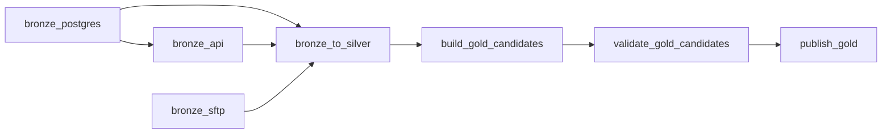

# Packet 4 — Airflow và local Lakehouse stack

## Reference files

- `reference_code/docker-compose.yml`
- `reference_code/Dockerfile.airflow`
- `reference_code/requirements.txt`
- `reference_code/db/init/01_databases.sql`
- `reference_code/polaris/setup/setup.sh`
- `reference_code/trino/...`
- `reference_code/dags/shopvn_daily.py`

Compose này là pipeline Compose riêng và join source network. Không chỉnh sửa source
Compose. Polaris/MinIO/Trino configuration được kế thừa từ HTML design nhưng vẫn
phải qua compatibility smoke test với image thực tế.

## DAG dependency



API chạy sau PostgreSQL vì cần danh sách order IDs. Gold task chỉ dùng default
`all_success`; không có trigger rule cho phép bỏ qua DQ failure.

## Schedule, SLA và backfill

- Schedule `02:00` hằng ngày để có sáu giờ trước SLA 08:00.
- Task retry hai lần, exponential delay 10–30 phút.
- `max_active_runs=1` tránh hai run cùng ghi chung date.
- `catchup=False` để deployment lần đầu không tự tạo hàng loạt historical runs.
- Historical load là manual run có review:

```powershell
airflow dags trigger shopvn_daily `
  --conf '{"start_date":"2026-06-01","end_date":"2026-06-30"}'
```

Với production volume lớn hơn homework, chạy backfill theo từng ngày hoặc small
window; không mở nhiều concurrent Spark local jobs trong giới hạn RAM 8 GB.

## Compatibility gates

1. `docker compose --env-file .env config` PASS.
2. Custom image có Java 17, Spark 3.5.6 và đủ ba JAR.
3. Polaris OAuth/catalog tồn tại sau restart.
4. Spark create/write/read Iceberg; metadata xuất hiện ở MinIO.
5. Trino đọc cùng table và không thể write vì cấu hình read-only.
6. Airflow scheduler parse DAG không có import error.

Nếu Polaris 1.7 trả management API khác reference, điều chỉnh script theo response
thật; không biến 401/403/5xx thành “already configured”.
