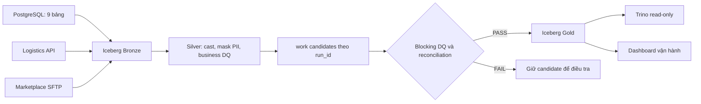

# Bộ hướng dẫn triển khai ShopVN Lakehouse

## 1. Trạng thái hiện tại

Repository thật hiện mới có:

- yêu cầu bài tập và dataset guide;
- Docker Compose khởi động ba nguồn PostgreSQL, Logistics API và SFTP;
- file HTML mô tả kiến trúc Iceberg;
- chưa có thư mục `pipeline/`, DAG, Spark job, test, CI/CD hoặc dashboard chạy thật.

Toàn bộ nội dung trong `guideline/` là **reference để đọc, so sánh và copy**.
Không file nào ở ngoài `guideline/` được thay đổi. Bộ reference này chưa phải bằng
chứng pipeline chạy end-to-end vì Docker daemon không hoạt động trong lúc kiểm tra.

## 2. Kiến trúc được áp dụng



Stack tham khảo: Spark 3.5.6 `local[2]`, Iceberg 1.10.1, Polaris 1.7.0,
MinIO, Trino 483 và Airflow 2.9.3 LocalExecutor. Source Compose giữ nguyên;
pipeline Compose riêng tham gia external network `session_11_final_project_shopvn-net`.

## 3. Gap analysis

| Nhóm | Trạng thái source thật | Reference đã cung cấp |
|---|---|---|
| Ingestion | Chưa có | PostgreSQL 9 bảng, API batch/retry, SFTP stream/MD5 |
| Bronze | Chưa có | Raw field + metadata kỹ thuật, Iceberg MERGE idempotent |
| Silver | Chưa có | Cast, PII hashing, anomaly flag, structural DQ |
| Gold | Chưa có | 8 fact candidates, customer SCD2, pre-Gold gate |
| Orchestration | Chưa có | Airflow DAG, retry, alert, SLA, backfill parameters |
| Observability | Chưa có | Audit tables và Streamlit/Trino dashboard |
| CI/CD và tests | Chưa có | Pytest, compile check, Compose validation workflow |
| Runbook | Chưa có | Ba kịch bản sự cố và quy trình rerun |
| Diagram/presentation | Chưa có | Kiến trúc có trong tài liệu; slide demo vẫn phải làm |

## 4. Thứ tự triển khai khuyến nghị

1. Đọc [01_bronze_hardening.md](01_bronze_hardening.md), copy common helpers và
   ba ingestion jobs. Chạy một ngày bình thường trước.
2. Đọc [02_silver.md](02_silver.md), xác nhận các business assumptions rồi chạy
   Silver DQ.
3. Đọc [03_gold_and_dq.md](03_gold_and_dq.md), tạo candidate, chạy gate và chỉ
   publish khi PASS.
4. Đọc [04_airflow.md](04_airflow.md), dựng stack local và DAG.
5. Đọc [05_operations.md](05_operations.md), chạy test, dashboard và failure drill.
6. Đối chiếu [review.md](review.md) trước khi nộp bài.

## 5. Cách copy reference

```powershell
Set-Location D:\Data Engineering\DataOps\master-class-dataops\session_11_final_project
New-Item -ItemType Directory -Path pipeline
Copy-Item guideline\reference_code\* pipeline\ -Recurse
Copy-Item pipeline\.env.example pipeline\.env
```

Sau khi copy, thay toàn bộ placeholder trong `.env`. Không commit `.env`.
Không dùng host port bên trong container: PostgreSQL là `postgres:5432`, API là
`http://api:8000`, SFTP là `sftp:22`.

## 6. Các assumption cần xác nhận trước khi coi là production behavior

- Direct revenue chỉ nhận order không `cancelled`, không dính discount anomaly và
  có `payment_status` là `paid` hoặc `refunded`; refund chỉ trừ khi return đã
  `refunded`.
- MISSING SFTP file vẫn cho Bronze xử lý partner còn lại, nhưng pre-Gold gate sẽ
  chặn Finance/Product của date đó cho tới khi đủ ba partner.
- Product review chỉ tồn tại trong PostgreSQL nên reference chỉ báo cáo rating cho
  direct web/app. Không được tự tạo marketplace rating.
- `inventory_transactions` không có `warehouse_id`; reference giả định mỗi product
  chỉ có một inventory row. Nếu source thực tế có nhiều warehouse cho một product,
  phải bổ sung allocation contract trước khi copy job inventory.

## 7. Kết luận trạng thái

Về mặt tài liệu và reference code, các phần bắt buộc đã được map đầy đủ. Bài tập
thật vẫn ở trạng thái **chưa implement/chưa runtime-verify** cho tới khi code được
copy vào `pipeline/`, stack khởi động thành công và toàn bộ gate trong `review.md`
được chứng minh bằng log/query.
