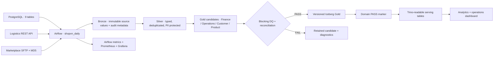

# ShopVN Lakehouse Pipeline

Daily analytics pipeline for PostgreSQL, a logistics REST API, and marketplace SFTP
files. Airflow orchestrates PySpark jobs that write Apache Iceberg tables through
Polaris to MinIO. Trino serves validated Gold Iceberg tables. Prometheus, Grafana, Airflow,
and a small operations dashboard expose runtime state.

The implementation targets the June 2026 course dataset. It is intentionally a
single-node learning stack, not a claim that the local Compose deployment is suitable
for production traffic.

## Data contract decisions

- Business timezone: `Asia/Ho_Chi_Minh`; daily schedule: 02:00; data deadline: 08:00.
- Simulated go-live: `2026-06-01`. Customer tier history starts on that date; no
  historical tier state is invented.
- Direct revenue includes non-cancelled orders with payment status `paid` or
  `refunded`, excludes discount anomalies, and deducts only returns whose status is
  `refunded`.
- Marketplace earned revenue follows the source export: gross sales less commission,
  using its binary-float-and-floor calculation; platform discount remains a separate cost.
  Settlement status is retained separately so Finance can also use the cash view.
- Zero-quantity lines remain in Silver for traceability but contribute zero eligible
  units and zero eligible line revenue.
- Full name, phone, and email become stable salted SHA-256 hashes in Silver. Ward and
  review free text are not propagated; city and district are retained.
- Missing SFTP files are audited and the unaffected ingestion paths continue. Finance,
  Operations return-rate, and Product publication remain blocked until the required
  partner files are complete. A corrupt checksum fails the SFTP branch immediately.

Authoritative field-level definitions and evolution rules are in [`contracts/`](contracts/README.md).

## Architecture



The object store is MinIO, Iceberg's REST catalog is Polaris, and Spark and Trino use
the same catalog. DQ-approved versions remain in `gold_versions`; physical Iceberg
tables in `serving` provide cross-engine reads. Publication is atomic per table, while
cross-table domain visibility is not a distributed transaction in this local stack.

## Prerequisites

- Docker Desktop with Compose v2 and at least 6 GB available memory.
- The source stack in the parent folder running and healthy.
- Ports 3000, 5434, 8000, 8080, 8081, 8181, 8501, 9000, 9001, and 9090 available.

## First run

1. Start the supplied source systems from `session_11_final_project`:

   ```bash
   docker compose up -d
   docker compose ps
   ```

2. In this `pipeline` folder, create a private runtime configuration:

   ```bash
   cp .env.example .env
   ```

   Replace every `<set-...>` value. Use the read-only source credentials documented by
   the course dataset. Generate random Airflow keys and a stable random `PII_HASH_SALT`.
   Never commit `.env`.

3. Confirm the external source network name. If the source project was started with a
   different Compose project name, set `SHOPVN_SOURCE_NETWORK` in `.env` to the network
   shown by `docker network ls`.

4. Validate and start the platform:

   ```bash
   docker compose --env-file config/version.env --env-file .env config --quiet
   docker compose --env-file config/version.env --env-file .env up -d --build
   docker compose --env-file config/version.env --env-file .env ps
   ```

5. Open Airflow at `http://localhost:8081`, enable `shopvn_daily`, then select the
   trigger button. The form has optional `Start date` and `End date` fields. Enter a
   bounded inclusive range such as `2026-06-01` through `2026-06-01` for a manual
   backfill. Leave both fields empty only to process the Airflow logical date. The end
   date must not precede the start date.

   Manual ranges are bounded by the job argument validator. Scheduled runs process the
   Airflow logical date. `catchup=False` is deliberate: historical execution requires
   an explicit range so a new deployment cannot accidentally launch an unbounded
   backfill.

## User interfaces

| Interface | Address | Purpose |
|---|---|---|
| Airflow | `http://localhost:8081` | DAG state, task logs, retry and SLA state |
| Operations dashboard | `http://localhost:8501` | Read-only evidence for Finance, Operations, Customer & Marketing, Inventory & Product; plus DQ, publication and source-integrity records |
| Trino | `http://localhost:8080` | Read-only analytical SQL endpoint |
| Grafana | `http://localhost:3000` | Scheduler and service health |
| Prometheus | `http://localhost:9090` | Metrics and alert inputs |
| MinIO | `http://localhost:9001` | Local object-store inspection |

## Validation commands

Run from this folder after installing the pinned Python 3.11 dependencies with the
Airflow 2.9.3 constraints file:

```bash
ruff format --check .
ruff check .
python -m compileall -q spark dags monitoring tests scripts
python scripts/check_for_secrets.py
bandit -q -r spark dags monitoring
pytest
docker compose --env-file config/version.env --env-file .env config --quiet
```

For the grading evidence, run the same logical date three times and execute
[`sql/reconciliation.sql`](sql/reconciliation.sql) after each run. Counts and amounts
must remain identical. The full acceptance matrix and evidence format are in
[`docs/validation-plan.md`](docs/validation-plan.md).

## Safe backfill and recovery

Trigger the same DAG with a bounded `start_date` and `end_date`. Iceberg MERGE keys make
Bronze, Silver, candidate, and version writes idempotent. The domain marker makes Gold
completion auditable, while each physical serving table is committed atomically. A
domain is not transactionally atomic across all of its tables, so consumers that need
a cross-table snapshot must require the domain PASS marker. Do not truncate tables or
advance a watermark to bypass a failed check. Follow
[`docs/runbook.md`](docs/runbook.md).

## Repository map

```text
contracts/                 reviewable source and model contracts
dags/                      thin Airflow orchestration
spark/jobs/ingestion/      PostgreSQL, API, and SFTP Bronze jobs
spark/jobs/transformation/ one module per Silver/Gold model
spark/jobs/validation/     pre-publication DQ and reconciliation
spark/jobs/publication/    versioned publication and physical serving tables
monitoring/                Prometheus, Grafana, and operations dashboard
sql/                       analytics and reconciliation queries
tests/                     unit, contract, model, and DAG tests
docs/                      design, runbook, and acceptance evidence plan
```

## Current verification boundary

Static checks can run without the source stack. Runtime claims require Docker and the
supplied source images and must be recorded as `PASS`, `FAIL`, or `NOT RUN` only from
actual evidence. See [`docs/validation-report.md`](docs/validation-report.md) for the
current executed matrix and outstanding acceptance gates.
