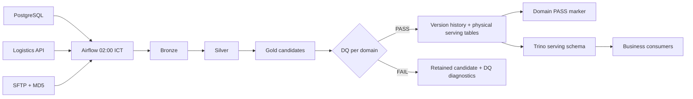
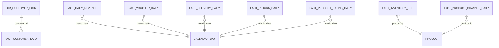

# Data Platform — Design Document

**Date**: 2026-08-15  
**Owners**: ShopVN Data Platform  
**Stewards**: Finance, Operations, Customer/Marketing, Product

## Table of Contents

1. [Context](#1-context)
2. [Problem Statement](#2-problem-statement)
3. [Solution Overview](#3-solution-overview)
4. [High Level Design](#4-high-level-design)
5. [Low Level Design](#5-low-level-design)
6. [Monitoring & Alerting](#6-monitoring--alerting)
7. [Runbook](#7-runbook)
8. [Trade-offs & Alternatives Considered](#8-trade-offs--alternatives-considered)

## 1. Context

ShopVN sells through its own web/app and Lazada, Shopee, and TikTok. Finance,
Operations, Marketing, and Product currently depend on disconnected PostgreSQL,
logistics API, and SFTP datasets. This platform creates governed daily analytics that
must be available before 08:00 Vietnam time, including three-times normal flash-sale
volume. Recovery must complete within two hours of incident detection.

## 2. Problem Statement

- Finance cannot reconcile direct revenue, marketplace net proceeds, refunds,
  discounts, commissions, and customer spend in one governed definition.
- Operations lacks historical carrier performance and must preserve orders that have no
  shipment record.
- Marketing has no reliable customer lifecycle, voucher, or forward-only loyalty-tier
  history.
- Product cannot compare direct and marketplace sales or reconstruct historical stock.
- Corrupt/missing files, API failures, source anomalies, and schema changes previously
  had no publication gate, evidence, or recovery procedure.

## 3. Solution Overview

A single daily Airflow DAG runs source-specific PySpark ingestion, model-scoped Silver
transforms, and four independently publishable business domains. Data is stored as
Iceberg tables in MinIO through Polaris. Gold is first written to run-scoped candidate
tables and validated, then copied to version history and physical serving tables that
Trino can read. A domain marker records completion after every table commit. This
preserves rerun safety, auditability, and partial domain availability without adding a
distributed cluster that the course dataset does not need; cross-table publication is
explicitly not transactional.

### Stack Choice

| Option | Chosen? | Justification |
|---|---:|---|
| DuckDB SQL DWH | No | Simpler, but does not exercise the requested Lakehouse schema-evolution, catalog, shared Spark/Trino read, or object-store path. |
| Spark + Apache Iceberg | Yes | Matches the selected project option and supports schema-aware MERGE, versioned tables, partitioned history, and a shared catalog. It runs locally with bounded Spark concurrency. |

### High-Level Data Flow

## 4. High Level Design

### 4.1 Architecture Diagram

The Mermaid diagram above is the required architecture-diagram fallback. It is kept in
source control so component and publication-flow changes are reviewable.

### 4.2 Component Overview

| Component | Technology | Role |
|---|---|---|
| Orchestration | Airflow 2.9.3 | Schedule, dependencies, bounded retries, backfills, SLA and alerts |
| Compute | PySpark 3.5.1 | Typed source ingestion and Bronze/Silver/Gold transforms; aligned with the Airflow 2.9.3 Python 3.11 constraint set |
| Table format | Iceberg 1.10.1 | ACID MERGE, schema inspection, partitioning and snapshots |
| Catalog | Polaris 1.7.0 | REST catalog and credential vending |
| Storage | MinIO | Local S3-compatible object store |
| Query | Trino 483 | Read-only serving over validated Gold Iceberg tables |
| Metadata | PostgreSQL 16 | Airflow and Polaris relational state |
| Observability | Airflow + Prometheus + Grafana + Streamlit | Task logs, component health, DQ, audit and reconciliation |

### 4.3 Reliability Boundary

Each business domain has a candidate, DQ, and publish chain. Customer analytics can
publish when SFTP is unavailable. Finance and Product wait for PostgreSQL and SFTP;
Operations waits for all three because its return-rate model uses direct and marketplace
sales. Failed DQ prevents serving writes; publication remains atomic at each Iceberg
table boundary.

## 5. Low Level Design

### 5.1 Data Model

| Model | Grain | Business key | Purpose |
|---|---|---|---|
| `fact_daily_revenue` | date × source × channel | `metric_date, source_type, channel` | Direct and marketplace earned/cash revenue |
| `fact_customer_daily` | date × customer | `metric_date, customer_id` | Daily/MTD spend and lifecycle |
| `fact_voucher_daily` | date × voucher | `metric_date, voucher_code` | Campaign usage, revenue, discount cost |
| `fact_delivery_daily` | date × carrier × province × failure reason | dimensional tuple | Success, attempts, failure, delivery time |
| `fact_return_daily` | date × category × channel | dimensional tuple | Eligible sold and returned units/rate |
| `fact_product_rating_daily` | date × category × direct channel | dimensional tuple | Review count and average rating |
| `fact_inventory_eod` | date × product × warehouse | dimensional tuple | Reconstructed closing stock |
| `fact_product_channel_daily` | date × product × channel | dimensional tuple | Units, revenue, loss, velocity, stockout |
| `dim_customer_scd2` | customer × effective version | `customer_id, valid_from` | Forward-only loyalty/location history |

The relationships are logical serving relationships; no extra calendar or product
dimension is materialized because current requirements do not justify it.

### 5.2 Extract Layer

- PostgreSQL performs a full snapshot of all nine small course tables through a
  read-only JDBC account. Source primary keys drive MERGE and preserve rerun identity.
- The API client validates batches of at most 50 order IDs, caps traffic at 95 requests
  per minute, retries timeouts with 1/2/4 second backoff, honors 429 `retry_after`,
  retries 500 once, records 404 as expected missing shipment, and fails on 400/401.
- SFTP streams in 1 MiB blocks to a `.part` file, verifies the mandatory MD5 supplied
  by the partner, atomically renames successful downloads, validates CSV headers, and
  writes a manifest. Missing files are warnings; corrupt files are quarantined and fail
  the branch.
- Bronze retains source identity, extraction timestamp, run ID, file/API batch identity,
  and a deterministic payload/row hash.

### 5.3 Transform Layer

Silver has one module per model. It explicitly casts source types, applies deterministic
keys, flags anomalies, protects PII, and retains traceability. Exact business rules:

- Discount above subtotal is flagged and excluded from revenue, not converted to a
  legitimate zero-revenue sale.
- Shipping fee zero is retained and flagged.
- Quantity zero is retained but contributes zero eligible units/revenue.
- Cost above base/actual price is a business loss flag, not a pipeline error.
- The API relationship to orders is left-preserving.
- Marketplace joins direct data only by `product_id`; no cross-source order join is
  fabricated.

Gold transformations are separate by output grain and grouped only at domain
publication boundaries. Customer lifecycle carries a pre-window prior order so bounded
backfills do not misclassify repeat purchases at the window boundary.

### 5.4 Load Layer

Bronze, Silver, candidate, version-history, and serving writes use Iceberg MERGE on
documented keys. Every candidate carries `run_id` and logical window. DQ results are
persisted before publish. Version tables retain run-specific outputs; physical serving
tables are written only after blocking DQ passes. A domain marker changes from
`PENDING` to `PASS` only after every model is committed. Each table commit is atomic,
but a mid-domain failure may leave only some serving tables updated; consumers needing
a cross-table-consistent snapshot must require the domain PASS marker and recovery may
need snapshot rollback for already committed tables.

### 5.5 Orchestration (Airflow)

- `shopvn_daily` starts at 02:00 `Asia/Ho_Chi_Minh`, warns at 07:30, and times out at
  08:00. `catchup=False` prevents accidental unbounded history.
- `max_active_runs=1`, two active tasks, and a one-slot Spark pool prevent concurrent
  local writers from contending for the same logical window.
- Only transient source failures retry. Contract, checksum, transform, DQ, and publish
  failures do not retry blindly.
- Manual backfills use explicit inclusive `start_date` and `end_date`; all jobs validate
  the range and reuse the same idempotent writes.

### 5.6 Technology Config

All image/library versions are pinned in `config/version.env`. `.env.example` is the
single deploy-time configuration matrix. Only the configuration boundary reads job
environment variables; business transforms receive validated arguments or config
objects. Real `.env` files are ignored. Source and analytical roles are logically
separated; Trino/dashboard access is read-only by design, though production RBAC must
be configured in the target environment.

### 5.7 Schema Evolution Strategy

- Additive source columns are tolerated in raw ingestion. Contracted Silver projections
  ignore unknown fields until reviewed, preventing accidental consumer exposure.
- Missing required fields, nullability violations, removals, and incompatible type
  changes block processing. Iceberg table comparison rejects removals and type changes
  instead of silently coercing them.
- A new SFTP partner is added through `SFTP_PARTNERS`; it still requires contract and
  owner review before it is considered complete for publication.
- Rename/drop/type/semantic changes require a contract version, impact analysis,
  compatibility migration, and owner approval.

### 5.8 Failure Handling

| Failure | Classification | Behavior | Recovery |
|---|---|---|---|
| API timeout/429/5xx | Transient | Bounded policy above; audit every terminal error | Rerun affected window after endpoint recovery |
| API 404 | Expected source absence | Record event, preserve order via LEFT JOIN | No retry unless source owner corrects data |
| Missing SFTP file | Late/incomplete | Audit warning, continue independent branches, block dependent Gold | Rerun same window after file arrival |
| MD5 mismatch/malformed CSV | Contract failure | Quarantine, fail SFTP, publish nothing dependent | Replace partner file; preserve evidence; rerun |
| Blocking DQ/reconciliation | Data correctness | Retain candidate and results; no PASS marker | Diagnose rule and source, then rerun same window |
| Mid-publication process failure | Technical | Marker remains PENDING/FAIL; one or more physical serving tables may already be committed | Stop cross-table consumers; rerun idempotently or roll affected tables back to recorded snapshots |

## 6. Monitoring & Alerting

Audit tables capture run, dataset, logical window, counts, amounts, duration, watermark,
status, error class, code/config/schema versions, and source manifest references. DQ
rows capture rule, severity, observed value, threshold, status, and diagnostics.

Airflow answers which task failed and when; Grafana/Prometheus show scheduler and service
health; the operations dashboard shows latest completion, freshness, domain publication,
DQ failures, rejected records, and revenue reconciliation. Email notification is sent
only when `SHOPVN_ALERT_EMAIL` is configured. Production paging and durable log export
remain deployment responsibilities.

## 7. Runbook

Operational procedures, safe rerun scope, reconciliation, rollback, late-file handling,
and recovery evidence are in [`runbook.md`](runbook.md). Target RPO is the prior
successful daily partition; target RTO is two hours. Bronze, manifests, DQ results,
audit history, and Iceberg snapshots must be retained for 90 days or the contract's
longer period. The local course stack does not implement production backup automation;
the recovery drill must verify catalog metadata plus object storage restore together.

## 8. Trade-offs & Alternatives Considered

- DuckDB would reduce operational cost and is sufficient for this dataset size. Iceberg
  was selected to meet the user-selected Lakehouse learning goal. Local Spark
  concurrency is deliberately bounded instead of adding a cluster.
- One DAG with four TaskGroups makes cross-source dependencies visible and keeps
  scheduling simple. Four independent DAGs would improve separate ownership but add
  coordination and backfill complexity without a current need.
- Domain-level atomic visibility is implemented with version tables and PASS markers.
  A single global swap would make unrelated teams unavailable when one source is late.
- PII is deterministically hashed to support stable joins. This leaks equality patterns,
  so production deployments should restrict access, protect the salt, and consider
  tokenization when reversal or rotation requirements exist.
- SCD2 starts at go-live because only current customer state exists. Historical tiers
  are explicitly unknown rather than inferred.
- Streaming, a separate lineage platform, data catalog UI, and LLM-assisted RCA are
  excluded as nice-to-have scope; audit metadata provides the minimum required lineage.
